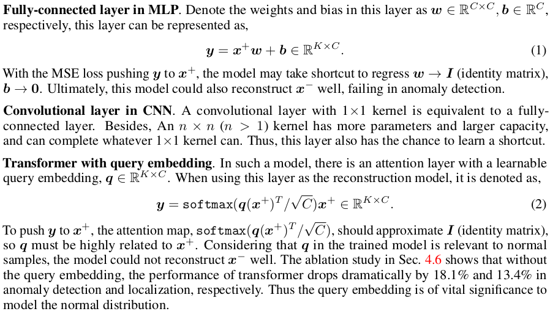
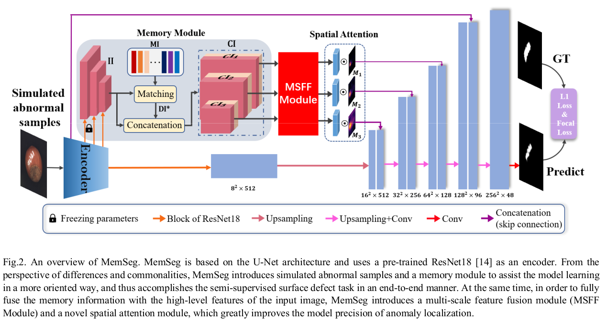

# Unsupervised Anomaly Detection (AD)

## Problem Definition
* Training data: normal data; Test data normal & abnormal data
* Anomaly detection is a binary classification between the normal and the anomalous classes. But there are challenges with pure classification method: 
  * Unknownness of the anomaly samples
  * Heterogeneous anomaly classes
  * Rarity and class imbalance.
* Anomaly detection or novelty detection, can be used in visual industrial inspections, i.e. industrial defects detection
* Surveillance security
* Unsupervised anomaly detection is also denoted as one-class classification or out-of-distribution detection which 
requires the model to determines whether the test image is normal or abnormal.

## Traditional Method
* **Statistical approaches** assess the geographic distribution of pixel
values by extracting statistical information from defect images. like histogram ...
* The **structural approaches**’ goals are to extract the
texture elements of defects, which are used to represent the spatial placement
rules. suit for texture defects.
* **Filter-based methods** apply some filter banks on defect images, and calcu-
late the energy of the filter responses. eg. Sobel operator, Canny operator, Gabor operator, Laplacian operator,
wavelet transform, and Fourier transform.

## Deep Anomaly Detection
### Overview

[//]: # (![overview.png]&#40;AnomalyDetection.assets/overview.png&#41;)
<div align="center">

</div>


### Unsupervised Method
* Learning feature of representation of normality
#### Generic Method
##### Autoencoders (reconstruction-based)
* [VAE](https://arxiv.org/pdf/1312.6114.pdf)

<div align="center">


<br>


</div>


* [MNAD](https://openaccess.thecvf.com/content_CVPR_2020/papers/Park_Learning_Memory-Guided_Normality_for_Anomaly_Detection_CVPR_2020_paper.pdf)

<div align="center">


</div>

* [UniAD](https://arxiv.org/pdf/2206.03687v3.pdf) 

- Working on "shortcut" problem in reconstructive method  
<div align="center">

</div>

- Model architecture:  
<div align="center">

</div>

- Feature jittering:  

feature token $\mathbf{f}_{tok}$  

```math
\mathbf{f}_{tok} \in \mathbb{R}^c \\
D \sim N(\mu = 0, \sigma^2 = (\alpha \frac{||\mathbf{f}_{tok}||_2}{C})^2)
```

* [EdgeRec](https://arxiv.org/pdf/2210.14485v1.pdf)  

- Input grayscale edge of the original test image and reconstruct it to the RGB image.

<div align="center">

</div>

* [DDAD](https://arxiv.org/pdf/2305.15956v1.pdf)

<div align="center">


</div>

* Anomaly score:

<div align="center">


</div>

where $D_p$ is the pixel-wise distance, and $D_f$ is the feature-wise distance  
$D_f$ is measured by cosine similarity   
$D_p$ is first set to L1_norm of the y_0 and x_t  

* Contribution:   
用了 Denoising model 做reconstruction


##### GAN-based
* [GAN](https://arxiv.org/pdf/1406.2661.pdf)


##### Normalizing Flow
* [Glow](https://arxiv.org/pdf/1807.03039.pdf)

A normalizing flow describes the transformation of a probability density through a sequence of invertible mappings. 
By repeatedly applying the rule for change of variables,
the initial density ‘flows’ through the sequence of invertible mappings.

[//]: # (![glow1.png]&#40;AnomalyDetection.assets/glow1.png&#41;)

[//]: # (![glow2.png]&#40;AnomalyDetection.assets/glow2.png&#41;)

<div align="center">


Architecture of Glow.


Key components of Glow


</div>


Compared to VAE/GAN:
- _**Pros**_: Directly compute $P_{x}(x)$; Easy to train;
- _**Cons**_: Sparse high dimensional latent space;

* [Same Same but DifferNet](https://arxiv.org/pdf/2008.12577.pdf)  

```math
f_{ex} : X -> Y; \quad  Y\ is\ the\ feature\ from\ feature\ extractor \\ 
f_{NF} : Y -> Z; \quad  Mapping\ Y\ to\ latent\ space \\ 
a \ well-defined\ distribution\quad P_{Z}(z); z \sim N (0, 1) \\
L(y) = \frac{||z||^2_{2}}{2} - log|det \frac{\partial{z}}{\partial{y}}|
```
$P_{Z}$ denotes the likelihood of image samples, anomalous samples have lower likelihood.  


The normalizing flow acts as a bijector between feature space Y and latent space Z by using affine transformations.
- _**Pros:**_ Multi-scale features; Exact likelihood of samples
- _**Cons:**_ Image-level anomaly detection no localization info. 

* [CFlow](https://arxiv.org/pdf/2107.12571v1.pdf)

```math
L(\theta) = D_{KL}[p_{Z}(z)||\hat{p}_{Z}(z, c, \theta)]
```


CFLOW can be seen as a OOD detector, which learns the distribution of anomaly-free patches x with $p_{X}(x)$ density and transforms it into a Gaussian distribution with $p_{Z}(z)$ density.


* [CSFlow](https://arxiv.org/pdf/2110.02855v1.pdf)


<center> coupling block </center>

* [FastFlow](https://arxiv.org/pdf/2111.07677v2.pdf)


#### Discriminative method
##### Distance-Based 
* [PaDiM](https://arxiv.org/pdf/2011.08785v1.pdf)

<div align="center">


</div>

For each position on normal image $(i, j)$, first compute patch embedding vector $X_{i,j}$
```math
X_{i,j} = \{x_{i,j}^k,\quad k \in [1, N]\} \\
X_{i, j} \sim N(\mu_{ij}, \Sigma_{ij})
```
Random dimension reduction reduce the redundant information of the patch features, and it's more efficient than PCA. 

Anomaly map is given by Mahalanobis distance.  

**_Pros_**: Patch feature.

**_Cons_**: Multivariate Gaussian distribution assumption

* [PatchCore](https://arxiv.org/pdf/2106.08265v2.pdf)

<div align="center">


</div>

* [MSPBA](https://openaccess.thecvf.com/content/WACV2022/papers/Tsai_Multi-Scale_Patch-Based_Representation_Learning_for_Image_Anomaly_Detection_and_Segmentation_WACV_2022_paper.pdf)

<div align="center">


</div>

Three scale patch features: patch sizes are 64, 32, 16

* [CFA](https://arxiv.org/pdf/2206.04325v1.pdf)

<div align="center">


</div>

* [PNI](https://arxiv.org/pdf/2211.12634v3.pdf)

Upgraded PNI.  
SOTA at mvtec_ad:  
99.56% and 98.98% AUROC scores in anomaly detection and localization, respectively.  

### Overview


##### Part 1. Modeling Normal Feature Distribution

The anomaly score of the patch-level feature $S(\mathbf{x})$ is estimated as the negative log-likelihood of $p(\Phi_i (\mathbf{x}))$

```math
S(\mathbf{x}) = - \log p(\Phi_i (\mathbf{x}))
```

This paper add position and neighboring feature $\Omega$, so the score would be:

```math
S(\mathbf{x}) = - \log p(\Phi_i (\mathbf{x}) | \Omega)
```

To model the probability from training features, this paper used embedding coreset $C_{emb}$ (the memory bank), so the normal probability of a patch $p(\Phi_i (\mathbf{x})| \Omega)$ can be expresses as:
```math
p(\Phi_i (\mathbf{x})| \Omega) = \sum_{c \in C_{emb}} p(\Phi_i (\mathbf{x}|c, \Omega)) p(c|\Omega)
```

Since the $p(c|\Omega)$ is a sparse distribution, to simplify:
```math
p(\Phi_i (\mathbf{x})| \Omega) = \mathop{ \max_{c \in C_{emb}}} p(\Phi_i (\mathbf{x}|c, \Omega)) T_\tau(p(c|\Omega))
```

where $T_\tau(x)$ is defined as: 
```math
T_\tau (x)=\left\{
\begin{array}{rcl}
1 ,       &       x > \tau \\
0,    &      otherwise.\\
\end{array} \right. 
```
$\tau$ lower than $1 / |C_{emb}|$ guarantees at least one of $c$ in $C_{emb}$ be a normal feature. In this paper, we set $\tau = 1 / (2|C_{emb}|)$ without optimizing.

Approximate $p(c|\Omega )$ :
```math
p(c|\Omega) \approx \frac{p(c|N_p(x)) + p(c|x)}{2}
```
where $p(c|N_p(x))$ is the normal feature in **neighborhood information** and modeled using **MLP**.

To simplify computation, author use distribution coreset $C_{dist}$ to represent $C_{emb}$ .

The neighborhood information is defined as a set of features that are within a $p \times p$ patch, excluding $\mathbf{x}$ itself: 
```math
N_p(\mathbf{x}) = \{\Phi_i (m, n) | |m-h| \leq p/2, \\
|n-w| \leq p/2, (m,n) \neq (h,w)
\}
```
To train the MLP, the input is a 1-dimensional vector obtained by concatenating all features in $N_p(\mathbf{x})$ , output has $|C_{dist}|$ nodes. The ground truth used for training is a one-hot vector, where the distribution coreset index closest to the true center feature vector is one, and the cross-entropy loss is calculated with the MLP output.

$p(c|\mathbf{x})$ i.e. $p(c_{dist}| \mathbf{x})$ is the **position information**, the $p(c_{dist}|\mathbf{x})$ is generated by accumulating the indices of $D_{dist}$ for each position $\mathbf{x}$ in all training images using algorithm 1 as follow:


(? 不太懂)

Then $p(\Phi_i(x) | c_{emb})$ is expressed in terms of an exponent of the distance between $\Phi_i(\mathbf{x})$ and $c_{emb}$ as in most existing methods:
```math
p(\Phi_i(x) | c_{emb}, \Omega) \approx p(\Phi_i(\mathbf{x})|x_{emb}) \approx e^{-\lambda ||\Phi_i(x) - c_{emb}||_2}
```


##### Part 2. Pixel-wise Refinement

Author trained a supervised refinement network using artificial defect image. 

The optimization goal: 
```math
\theta^* = \mathop{argmin_\theta} \sum_{(I, \hat{A}, A) \in D} \ell (f(I, \hat{A}; \theta), A)
```
where $I$ is an artificially generated anomaly image, and A represents the ground-truth anomaly map of $I$ as a binary map, $\hat{A}$ is an anomaly map estimated from proposed algorithm.

Author used modified DenseNet161 as backbone, and encoder-decoder architecture for $f$. The input is 4-channel RGB image and an anomaly map 

The architecture as followed :


Loss function:
```math
\ell = (\ell_{reg} + \ell_{grad})/2  \\
\ell_{reg} = \frac{||\hat{A} - A||_2}{HW},  \\ 
\ell_{grad} = \frac{||\bigtriangledown_h \tilde{A} - \bigtriangledown_h A ||_2 
+ ||\bigtriangledown_w \tilde{A} - \bigtriangledown_w A||_2}{2HW}
```
where the $H$ and $W$ are the width and height of A, $\bigtriangledown_h$ and $\bigtriangledown_w$ are partial derivative operations.


FYI, author compared four method to generate synthetic data, CutPaste, CutPaste (scar), DREAM and mannual drawing, the conclusion as quote: 

"As pointed out in CutPaste, training with defects of varying sizes and shapes together prevents the network from optimizing in a naive direction and enables better generalization performance. This is a significant advantage in cases where real abnormal data is unknown. Figure 3 shows the defect image examples generated by 4 methods from normal MVTec AD training data. Defects generated by each method have distinct characteristics. CutPaste creates rectangular defects in larger areas, while CutPaste (scar) produces more detailed and thinner defects. DRÆM and manual methods generate a more complex variety defect patterns. "

Figure 3:


##### Experimental Results


* [FAPM](https://arxiv.org/pdf/2211.07381v1.pdf)

<div align="center">

</div>

# Semi-supervised Learning

- [MemSeg](https://arxiv.org/pdf/2205.00908v1.pdf)

<div align="center">



</div>

**Method:**  
- Generation of abnormal samples by artificial simulation  
  Add perlin noise
<div align="center">

</div>
- Memory Module
- Feature Fusion and spatial attention
<div align="center">

</div>


- [WinClip](https://arxiv.org/pdf/2303.14814.pdf)

**Method:** 

<div align="center">

</div>

- CPE  

(a) state words per label.  

(b) text templates, rather than freely writing definitions.  

- WinClip zero-shot
<div align="center">

</div>

- [SAA](https://arxiv.org/pdf/2305.10724.pdf)

<div align="center">

</div>


# Self-supervised Learning

- [Dream](https://arxiv.org/pdf/2108.07610v2.pdf)

**Method:**  
- Anomaly generation 
<div align="center">

</div>

- Model architecture  

<div align="center">

</div>

**Loss:**
- Reconstruction: $SSIM(I, I_r)$

- Segmentation: Focal Loss

- Total loss: $L(I, I_r, M_a, A) = L_{rec}(I, I_r) + L_{seg}(M_a, M)$

- The Structural Similarity Index (SSIM) Loss: 

  The system separate similarity measurements into three aspects: luminance, contrast and structure

  
  $$
  Luminance: l(\mathbf{x}, \mathbf{y}) = \frac{2 \mu_x \mu_y + C_1}{\mu_x^2 + \mu_y^2 + C_1} \\
  
  Contrast: c(\mathbf{x}, \mathbf{y}) = \frac{2 \sigma_x \sigma_y + C_2}{\sigma_x^2 + \sigma_y^2 + C2} \\
  
  Structure: s(\mathbf{x}, \mathbf{y}) =\frac{\sigma_{xy} + C_3}{\sigma_x \sigma_y + C_3} \\
  
  SSIM(x, y) = \frac{(2 \mu_x \mu_y + C_1)(2 \sigma_{xy} + C_2)}{(\mu_x^2 + \mu_y^2 + C_1)(\sigma_x^2 + \sigma_y^2 + C_2)}
  $$
  Where $\mu_x , \mu_y$ is the mean intensity, $\sigma_x, \sigma_y$ is the deviation. 


* [SSPCAB](https://arxiv.org/pdf/2111.09099v6.pdf)


## Category of Anomaly 
* intrusion detection
* fraud detection
* medical anomaly detection
* log anomaly detection
* time series anomaly
* industrial anomaly
* etc..