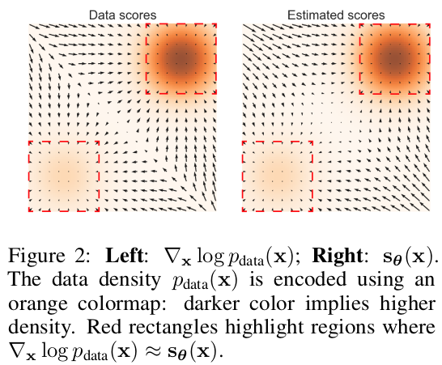
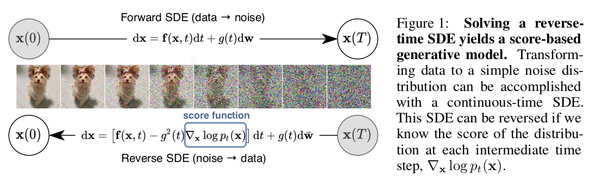
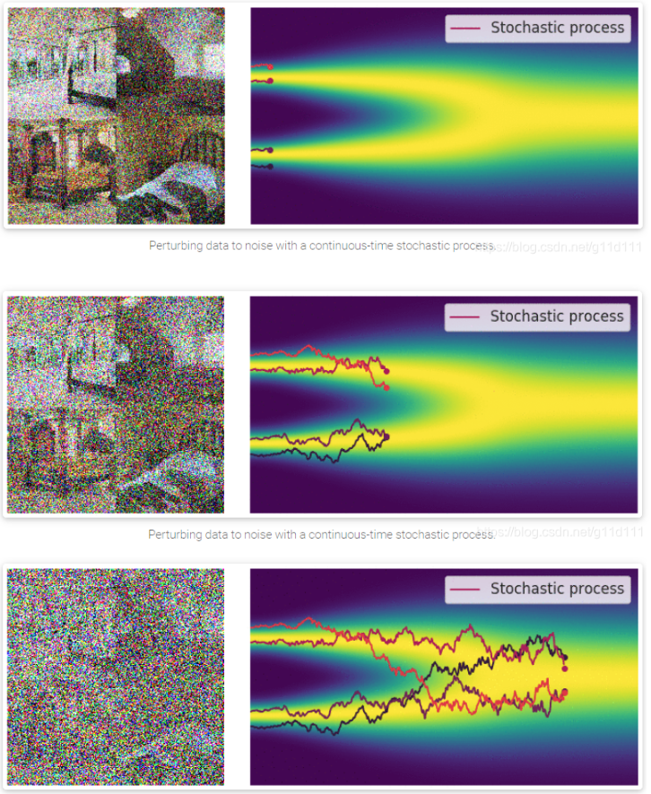
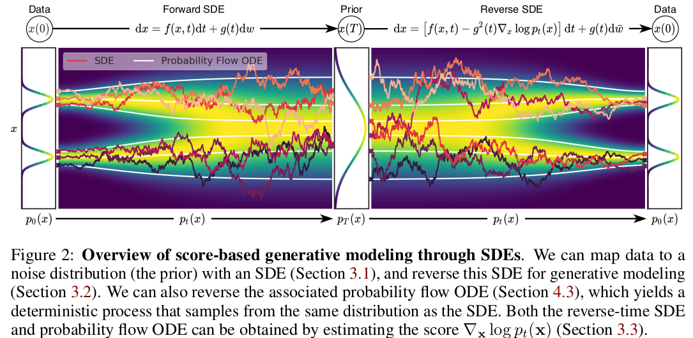

# Diffusion-based Generative Model


### [Generative Modeling by Estimating Gradients of the Data Distribution ](https://arxiv.org/pdf/1907.05600.pdf)

#### Definition of $score$

  the $score$ of a probability density $p(x)$ is $\bigtriangledown_x log(p(x))$

#### Involve two ingredients:

  - Score-matching; 

  - Langevin Dynamics


#### Likelihood model: 
```math
p_\theta(\mathbf{x}) = \frac{e^{-f_\theta(x)}}{Z_{\theta}}
```

  Where $Z_\theta > 0$ is normalizing constant depends on $\theta$ , $f_\theta(x)$ is unnormalized model, or EBM model. $Z_\theta$ is used to ensure integral of p.d.f equals to 1.

  The objective function of likelihood mode is 
```math
  max_\theta \sum_{i=1}^N log p_\theta(x_i)
```
  maximize log likelihood

- **For Flow-based model:** restrict model structure to make $Z_\theta = 1$

- **for variational inference in VAEs, MCMC etc:**  approximate $Z_\theta$ 

- But for score-based model, modeling gradient of the probability density function instead of pdf itself.
$$
s_\theta(\mathbf{x}) = \bigtriangledown_x log p_\theta = -\bigtriangledown_x log Z_\theta = - \bigtriangledown_xf_\theta(\mathbf{x})
$$


#### Langevin dynamics:

  Given a fixed step size $\varepsilon > 0$ and a initial value $\tilde{x_0} \sim \pi(x)$ with $\pi$ being a prior distribution, the Langevin method recursively compute the following:
```math
  \mathbf{\tilde{x_t}} = \mathbf{\tilde{x_{t-1}}} + \frac{\varepsilon}{2} \bigtriangledown_\mathbf{x} log(p(\mathbf{\tilde{x_{t-1}}})) + \sqrt{\varepsilon} \mathbf{z_t}
```

when $\varepsilon \to 0$ and $T \to \infty$ , $\tilde{x_t} \sim p(x)$  


#### Score Matching:

  Optimize objective function: 
```math
  J(\theta) = \frac{1}{2} E[||s_\theta(x) + \bigtriangledown_x log p_{data}(x)||^2]
```
  which is equivalent to:
```math
  J(\theta) = E_{p_{data}}[tr(\bigtriangledown_x s_\theta(x)) + \frac{1}{2}||s_\theta(x)||_2^2]
```
  Under the manifold hypothesis, score-based generative models will face two key difficulties: 

  First, since the score $\bigtriangledown_xlog p_{data}(x)$ is a gradient taken in the  ambient space, it is undefined when $\mathbf{x}$ is confined to a low dimensional manifold. 

  Second, the score matching objective function provides a consistent score estimator only when the support of the data distribution is the whole space and will be inconsistent when the data reside on a low-dimensional manifold.

<div align="center">

</div>


#### Noise Conditional Score Networks: learning and inference: 

  Let $\{\sigma_i\}_{i=1}^L$ be a positive geometric sequence that satisfies $\sigma_1  < \sigma_2 ... <\sigma_L$

  The perturbed data distribution: 
```math
  q_\sigma(x) = \int p_{data}(\mathbf{t}) N(x|\mathbf{t}, \sigma^2I)d\mathbf{t}
```
  Train a network to jointly estimate the score of all perturbed data distribution $S_\theta$, which is called Conditional Score Network. 


### [Score-based generative modeling through stochastic differential equations](https://arxiv.org/pdf/2011.13456v2.pdf)
<div align="center">

</div>

- Propose to generalize an infinite number of noise scales. The perturbation process can be considered as continuous-time stochastic process. This diffusion process can be modeled as the solution to an Itô SDE. 

  (随机的随机过程是SDEs随机微分方程的解)

#### - SDE:

```math
d\mathbf{x} = \mathbf{f}(x, t)dt + g(t)d\mathbf{w}
```
<div align="center">

</div>

where $\mathbf{w}$ is the standard Wiener process (Brownian motion 标准布朗运动), $\mathbf{f}(\cdot , t): \mathbb{R}^d \to \mathbb{R}^d $ （漂移系数） is vector-value function called drift coefficient of $\mathbf{x}(t)$ and $g(\cdot): \mathbb{R} \to \mathbb{R}$ （扩散系数） is scalar function known as the diffusion coefficient of $\mathbf{x}(t)$ .

可以看作常微分方程的随机化

$\mathbf{x}(t) \sim p$ and $\mathbf{x}(0) \sim p_{0}$ and $\mathbf{x}(T) \sim p_{T}$ 

#### - Generating samples by reversing the SDE:

```math
d\mathbf{x} = [\mathbf{f}(x, t) - g(t)^2 \bigtriangledown_x log p_t(x)]dt + g(t)d\bar{\mathbf{w}}
```

#### - Estimating score for the SDE:

```math
J(\theta) = E_{t \in U(0, T)}E_{p_t(x)}[\lambda(t) || \bigtriangledown_x log p_t(x) - s_\theta(x, t)||_2^2]
```

#### - Reverse SDE:

```math
d\mathbf{x} = [\mathbf{f}(\mathbf{x}, t) - g^2(t) \bigtriangledown_x log p_t(x)]dt + g(t)d\mathbf{\bar{w}}
```
<div align="center">

</div>

#### - FID (Frechet Inception Distance)

Take both the real data and generated data's activation feature maps from Inception V3, then FID is defined as:
```math
d^2((\mu, \Sigma), (\mu_w, \Sigma_w)) = ||\mu - \mu_w||_2^2 + tr(\Sigma + \Sigma_w - s(\Sigma \Sigma_w)^{\frac{1}{2}})
```

Where $\mu, \Sigma$ is the mean and  covariance of the real data, $\mu_w, \Sigma_w$ is the mean and  covariance of the generated data. 

The smaller the FID, the better data the model generated. 


#### -Inception score (IS):

Take the output of Inception V3 model


