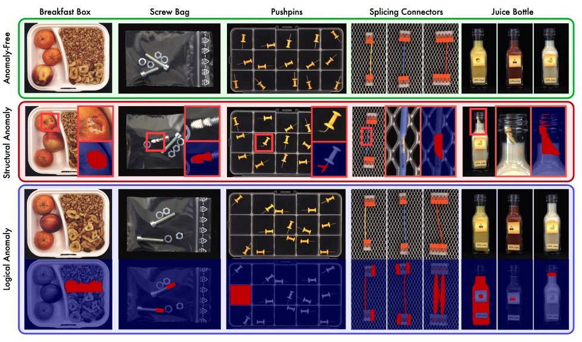
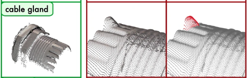
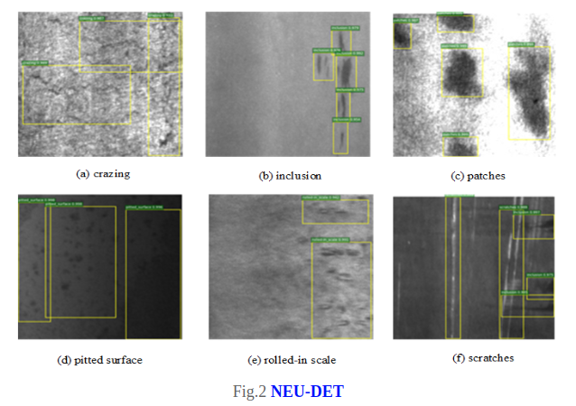
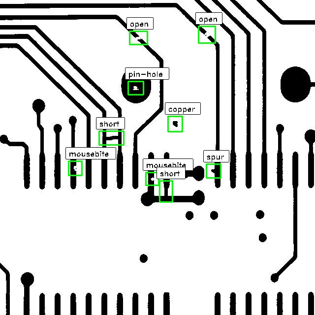

## Industrial anomaly detection Dataset

### Unsupervised Segmentation data

- MvTec AD
- MvTec AD LOCO
- VisA
- KolektorSDD
- KolektorSDD2
- AeBAD
- Magnetic-tile-defect
- BTAD
- ELPV
- MIAD
- CrackForest
- NEU

### Detection

Segmentation

#### MvTec AD LOCO
- **Task setting**: Unsupervised anomaly detection
- **Source**: real-world industrial inspection scenarios.
- **Data type**: 3644 images, 5 categories.
- **Annotations**: 
- **Address**: https://www.mvtec.com/company/research/datasets/mvtec-loco

#### MvTec Screw
- **Task setting**: Oriented box detection
- **Source**: Screws and nuts placed on a wooden background
- **Data type**: 384 images of 13 different types of screws
- **Annotations**: oriented bounding boxes and their respective category
- **Address**: https://www.mvtec.com/company/research/datasets/mvtec-screws

#### MvTec 3D-AD 
- **Task setting**: Unsupervised anomaly detection and localization 
- **Source**: 
- **Data type**: 4000 high-resolution scans and 10 different object categories
- **Annotations**: 3d segmentation mask
- **Address**: https://www.mvtec.com/fileadmin/Redaktion/mvtec.com/company/research/datasets/mvtec_itodd.pdf

#### NEU surface defect
- **Task setting**: Classification / Detection
- **Source**: Six kinds of typical surface defects of the hot-rolled steel strip. Defect type: rolled-in scale (RS), patches (Pa), crazing (Cr), pitted surface (PS), inclusion (In) and scratches (Sc)
- **Data type**: 1,800 grayscale images: 300 samples each of six different kinds of typical surface defects. The size of image is 200 * 200.
- **Annotations**: Classification label and bbox.
- **Address**: http://faculty.neu.edu.cn/songkc/en/zdylm/263265/list/index.htm

#### CrackForest 
- **Task setting**: Supervised segmentation. 
- **Source**: CrackForest Dataset is an annotated road crack image database which can reflect urban road surface condition in general.
- **Data type**: ~300 images
- **Annotations**: Segmentation mask.
- **Address**: https://github.com/cuilimeng/CrackForest-dataset

#### MIAD  
!!Simulated data!!
- **Task setting**: Unsupervised anomaly detection. 
- **Source**: 100K high-resolution color images in various outdoor industrial scenarios. This dataset is generated by a 3D graphics software.
- **Data type**: 7 scenario (one failed download), each contains 10,000 RGB training images.
- **Annotations**: logical anomalies with pixel-precise segmentation mask, and image-level label.
- **Address**: https://miad-2022.github.io/

#### ELPV  
- **Task setting**: Classification
- **Source**: **solar cell images** extracted from high-resolution electroluminescence images of photovoltaic modules.
- **Data type**: 2,624 samples of 300x300 pixels 8-bit grayscale images.  
- **Annotations**: defect probability (a floating point value between 0 and 1)
- **Address**: https://github.com/zae-bayern/elpv-dataset  

#### DeepPCB:   
- **Task setting**: Object Detection
- **Source**: . The Deep PCB is a manufacturing defect data set. 
- **Data type**: 1500 image pairs 640*640 size. Each has a template image & a test image. The template image has no defects & corresponding test image
that has some defects with the annotations.
- **Annotations**: Bbox annotation in json format
- **Address**: https://github.com/avs-abhishek123/DeepPCB-to-COCO
                http://ijream.org/papers/IJREAMV08I0286072.pdf
 

#### KolektorSDD
- **Task setting**: Unsupervised anomaly detection 
- **Source**: The images were captured in a controlled industrial environment in a real-world case
- **Data type**:   
    399 images:   
    52 images with visible defects  
    347 images without any defect  
Original images of sizes:  
width: 500 px  
height: from 1240 to 1270 px  
- **Annotations**: Segmentation mask and bbox.
- **Address**: https://www.vicos.si/resources/kolektorsdd/

#### KolektorSDD2
- **Task setting**: Unsupervised anomaly detection or detection
- **Source**: The images were captured in a controlled industrial environment in a real-world case
- **Data type**:   
356 images with visible defects  
2979 images without any defect  
- **Annotations**: Segmentation mask and bbox
- **Address**: https://www.vicos.si/resources/kolektorsdd2/

- CCTV pipe/QV pipe:  
竞赛数据，要填申请,不考虑

#### MvTec D2s
超市数据，暂不考虑

- DeepPCB:   
- **Task setting**: 
- **Source**: 
- **Data type**: 
- **Annotations**: 
- **Address**: