# Task Setting

### core scenarios:

Language model
- Taxonomy
- Selection
- Question answering
- Information retrieval
- Summarization
- Sentiment analysis
- Toxicity detection
- Miscellaneous text classification

Multimodal:
- Image captioning
- Vision question answering
- Text generation
- 

### [HELM](https://arxiv.org/pdf/2211.09110.pdf)

# Multimodal

### [S-Prompt](https://arxiv.org/pdf/2207.12819.pdf)

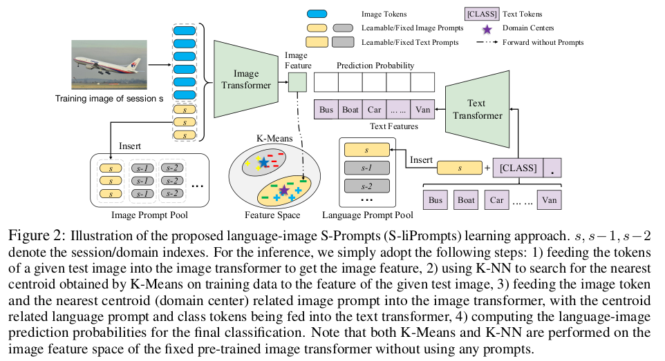

### [PaLM-E](https://arxiv.org/abs/2303.03378)

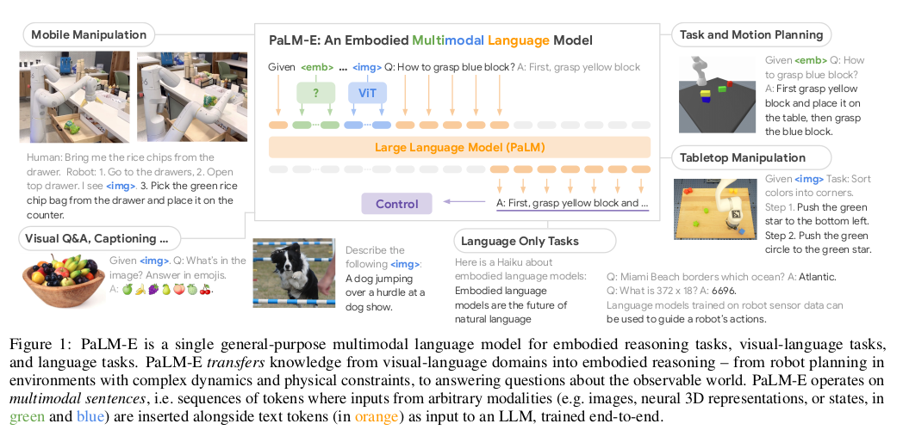

### [SAM](https://arxiv.org/abs/2304.02643)

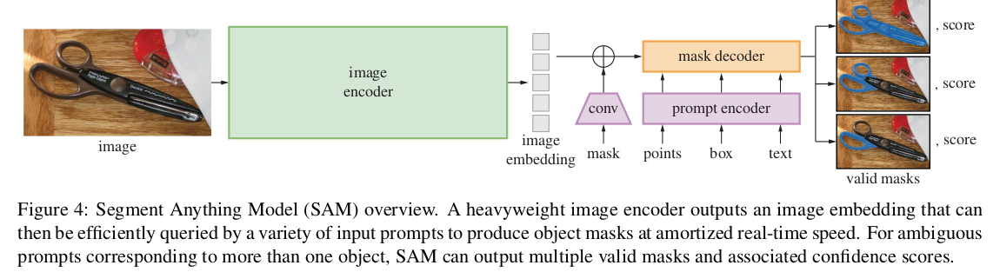

### [OpenSeed](https://github.com/IDEA-Research/OpenSeeD)

 
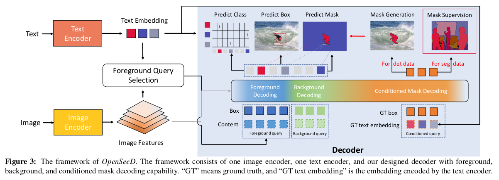

### [SEEM](https://arxiv.org/pdf/2304.06718.pdf)

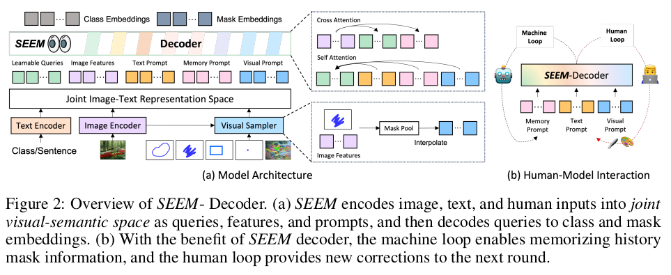
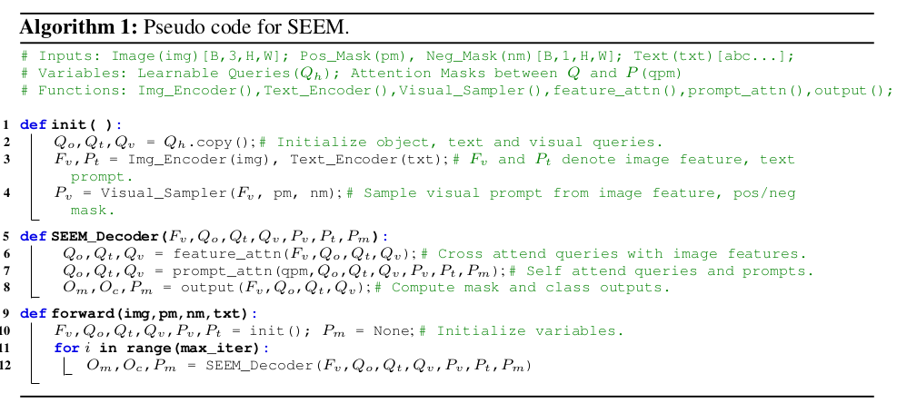

- **Difference between SAM:**
1. Versatility. (Receive various prompts)
2. Semantic-awareness. Add text encoder to encode text queries and mask labels into the same semantic space for open-vocabulary segmentation.

### [CLIPSeg](https://arxiv.org/pdf/2112.10003v2.pdf)

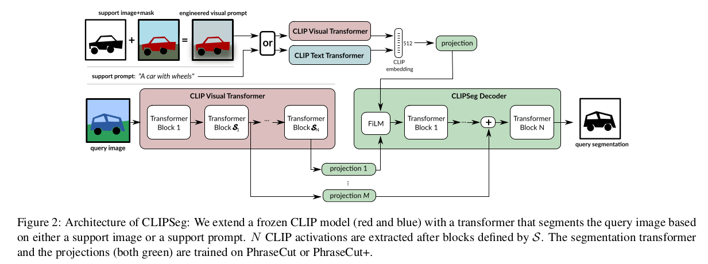

### [LLaVA](https://arxiv.org/pdf/2304.08485.pdf)

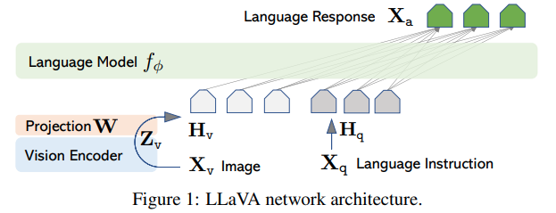

### [MetaLM](https://arxiv.org/pdf/2206.06336.pdf) 

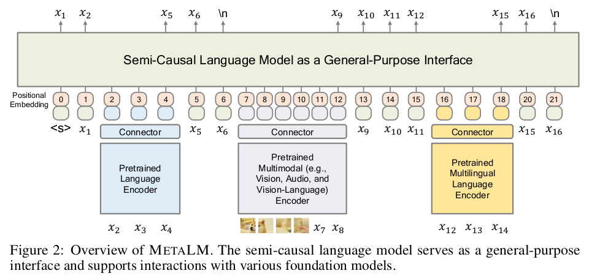

### [MaskDINO](https://arxiv.org/pdf/2206.02777v3.pdf)

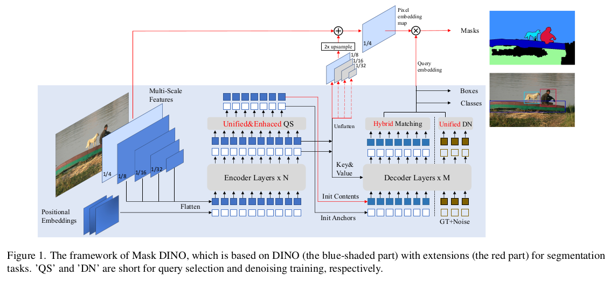

### [SAM-Med2D](https://arxiv.org/pdf/2308.16184.pdf)

### [PolyFormer](https://arxiv.org/pdf/2302.07387.pdf)

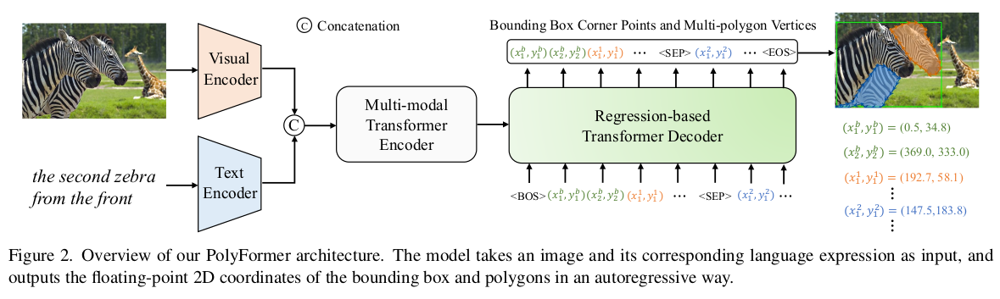

- https://github.com/amazon-science/polygon-transformer

##### data processing
- vertex that is closest to the top left corner of the image as the starting point of the sequence
- maintain the continuous floating-point value of the original x or y coordinate  
- To represent multiple polygons, we introduce a separator token <SEP> between two polygons. 
- Finally, we use <BOS> and <EOS> tokens to indicate the beginning and end of the sequence. 
- The coordinates of the bounding box and multiple polygons can be concatenated together
- Different levels of granularity polygons as data augmentation.

##### Decoder
- add 1D and 2D relative position bias to image and text features, respectively.

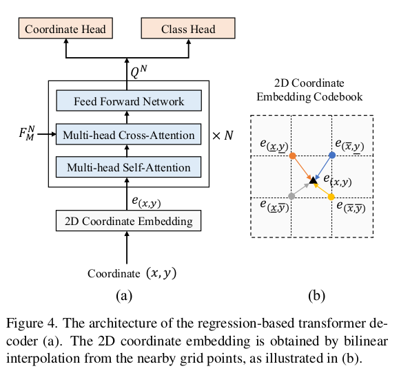

##### Loss

L = L1 regression loss + label smoothed cross-entropy loss  
$$
L_t = \lambda_t L_{coo}((x_t, y_t), (\hat{x}_t), \hat{y}_t) | I, T, (x_i, y_i)_{i=1:t-1}) \\
\cdot + \lambda_{cls}L_{cls}(p_t, \hat{p}_t | I, T, p_{1:t-1}),
$$

##### Training details
- PolyFormer pre-trained on the REC task with the combination of Visual Genome, RefCOCO, RefCOCO+, RefCOCOg, and Flickr30k-entities.

