# Task Setting

### core scenarios:

Language model
- Taxonomy
- Selection
- Question answering
- Information retrieval
- Summarization
- Sentiment analysis
- Toxicity detection
- Miscellaneous text classification

Multimodal:
- Image captioning
- Vision question answering
- Text generation
- 

### In-Context Learning
<div align="center">
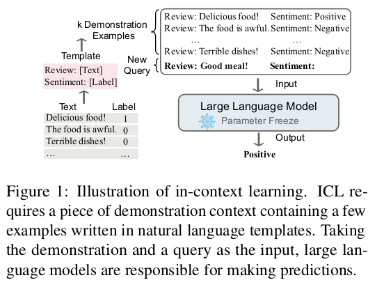
</div>
A prompt contains three components: a format, a set of training examples, 
and a permutation (ordering) for those examples. 
--- 《Calibrate Before Use: Improving Few-Shot Performance of Language Models》
A prompt contains three components: a format, a set of training examples, 
and a permutation (ordering) for those examples.

<div align="center">
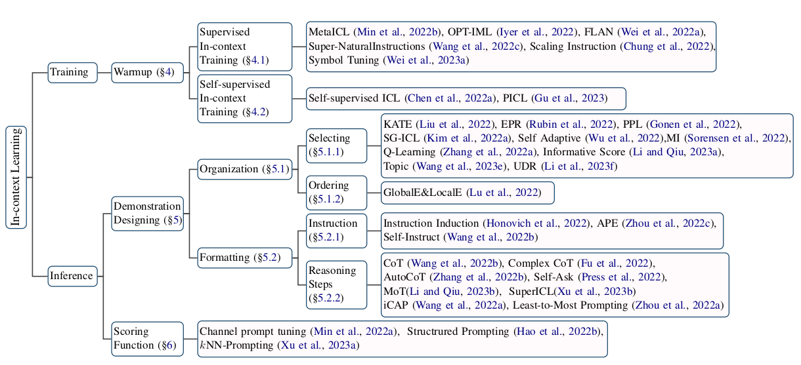
<div>Taxonomy of ICL. </div>
</div>

**1. Demonstration Organization**

How to select demonstrations:
1. selecting the closest neighbors, the distance method is L2 or cos sim: e.g KATE (KNN)
2. select diverse demonstrations to cover different kinds of training demonstrations. 
3. human-labeled data
4. Supervised method: built an unsupervised retriever (e.g., BM25) to recall similar examples as candidates and then 
built a supervised retriever EPR to select demonstrations

How to order demonstrations: 
1. sorted examples decently by their distances to the input
2. global and local entropy metrics. They found a positive correlation between the entropy metric and the ICL performance.

Scoring function:
1. Sentence Perplexity (PPL) computes the perplexity of the whole sentence
2. Estimating the input query given the context.

What Influences ICL Performance: 
1. Input-label pairing format
2. label space
3. input distribution
4. input-label mapping


### why Transformer outperforms resnet?
<div align="center">
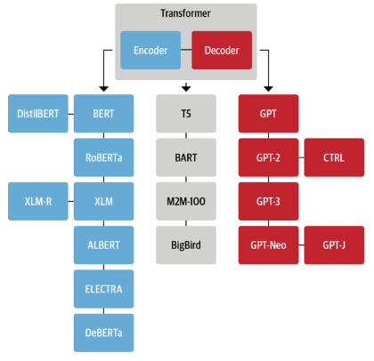
</div>
- Transformer: attention
```math
SA = W_v X softmax(\frac{(W_q X)^T(W_kV)}{\sqrt{D}})
```
二阶甚至三阶的函数，表达能力更强
Transformer 比resnet的非线性性强很多
是不是用更复杂的base分解，效果会更好？

### Lipschitz continuity  
```math
||f(x_2) - f(x_1)|| \leq k_0||x_2 - x_1||
```
存在有限的$k_0$，使公式一直成立，则满足Lipschitz 连续，且$k_0$的最小值，为Lipschitz constant


### [BERT](https://arxiv.org/abs/1810.04805)
- Contribution:  
bidirectional training  
使用mask lm作为pre-training task  

- Architecture:   
Transformer  
BERT BASE (L=12, H=768, A=12, Total Parameters=110M)  
BERT LARGE (L=24, H=1024, A=16, Total Parameters=340M)  

- Task settings:  
Pre-training: 
Mask LM  
Next sentence predict 判断IsNext/NotNext, 主要是为了判断句子之间的关系，帮助QA/NLI等下游任务  
Fine-tuning:  
<div align="center">
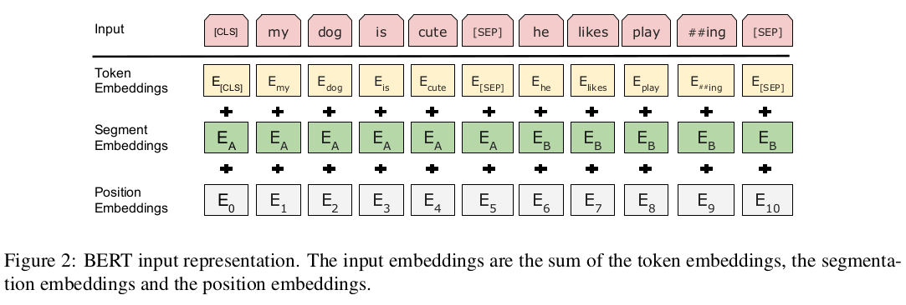   
</div>
<div align="center">BERT Inputs</div>


### [T5](https://arxiv.org/abs/1910.10683)
<div align="center">
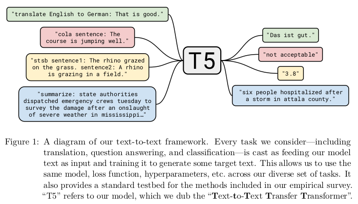
</div>

- Contribution:
1. Introduced a unified framework that converts all text-based language problems into a text-to-text format.  
2. Use the same model, loss function and hyperparameters across different tasks.
3. Proposed Colossal Clean Crawled Corpus (C4).

- Architecture: both the encoder and decoder consist of 12 blocks  


### [HELM](https://arxiv.org/pdf/2211.09110.pdf)


# Multimodal

### [S-Prompt](https://arxiv.org/pdf/2207.12819.pdf)

<div align="center">

</div>

### [PaLM-E](https://arxiv.org/abs/2303.03378)
<div align="center">

</div>


### [SAM](https://arxiv.org/abs/2304.02643)
<div align="center">

</div>


### [OpenSeed](https://github.com/IDEA-Research/OpenSeeD)

<div align="center"> 

</div>


### [SEEM](https://arxiv.org/pdf/2304.06718.pdf)
<div align="center">


</div>

- **Difference between SAM:**
1. Versatility. (Receive various prompts)
2. Semantic-awareness. Add text encoder to encode text queries and mask labels into the same semantic space for open-vocabulary segmentation.


### [CLIPSeg](https://arxiv.org/pdf/2112.10003v2.pdf)
<div align="center">

</div>


### [LLaVA](https://arxiv.org/pdf/2304.08485.pdf)
<div align="center">

</div>


### [MetaLM](https://arxiv.org/pdf/2206.06336.pdf) 
<div align="center">

</div>

### [MaskDINO](https://arxiv.org/pdf/2206.02777v3.pdf)
<div align="center">

</div>

### [SAM-Med2D](https://arxiv.org/pdf/2308.16184.pdf)


### [PolyFormer](https://arxiv.org/pdf/2302.07387.pdf)

<div align="center">

</div>

- https://github.com/amazon-science/polygon-transformer

##### data processing
- vertex that is closest to the top left corner of the image as the starting point of the sequence
- maintain the continuous floating-point value of the original x or y coordinate  
- To represent multiple polygons, we introduce a separator token <SEP> between two polygons. 
- Finally, we use <BOS> and <EOS> tokens to indicate the beginning and end of the sequence. 
- The coordinates of the bounding box and multiple polygons can be concatenated together
- Different levels of granularity polygons as data augmentation.

##### Decoder
- add 1D and 2D relative position bias to image and text features, respectively.

<div align="center">

</div>

##### Loss

L = L1 regression loss + label smoothed cross-entropy loss  
$$
L_t = \lambda_t L_{coo}((x_t, y_t), (\hat{x}_t), \hat{y}_t) | I, T, (x_i, y_i)_{i=1:t-1}) \\
\cdot + \lambda_{cls}L_{cls}(p_t, \hat{p}_t | I, T, p_{1:t-1}),
$$


##### Training details
- PolyFormer pre-trained on the REC task with the combination of Visual Genome, RefCOCO, RefCOCO+, RefCOCOg, and Flickr30k-entities.


### [CogVLM](https://arxiv.org/pdf/2311.03079v1.pdf)

<div align="center">
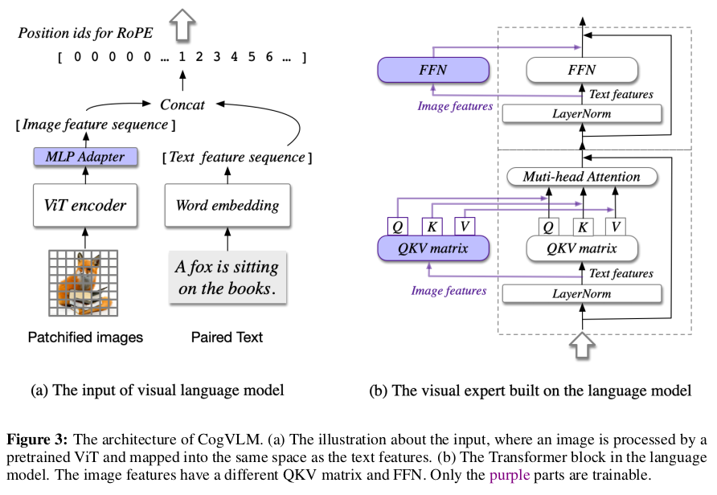
</div>

### [LVM](https://arxiv.org/pdf/2312.00785.pdf)

- Model architecture
<div align="center">
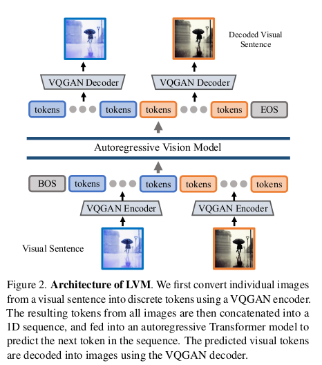
</div>

- Data annotation
<div align="center">
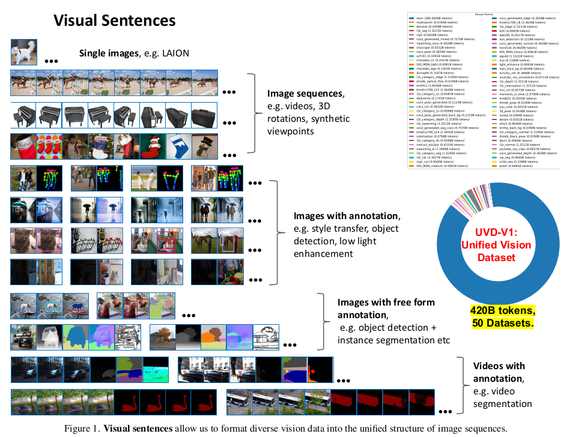
</div>

- **'visual sentence'**: Visual sentences of 16 frames are formed by randomly sampling the videos at three different strides (10, 20, and 30).

不同的数据标注方式：  
- each visual sentence is constructed by concatenating frames with their annotations – {frame1,annot1,frame2,annot2,...}. 
- The second method involves grouping multiple frames followed by their corresponding annotations – {frame1,frame2,annot1,annot2,...}

1) Object Detection: We create annotations by overlaying a color-coded bounding box around each object, following the methodology in [15]; 
2) Human Pose: Human skeletons are rendered in pixel space, adhering to the OpenPose format, utilizing MMPose [20]; 
3) Depth Estimation, Surface Normal, and Edge Detection: given ImageNet
and COCO images, we generate annotations in line with
the protocols from. 
4) Style Transfer, De-rain, De-noise, Low Light Enhancement, and Stereo Datasets: These are all represented as image pairs (e.g.input/output). 
5) Colorization: We convert ImageNet images to greyscale, producing image pairs. 
6) Inpainting:The process involves randomly adding black-colored boxes

### [PALI]()

<div align="center">
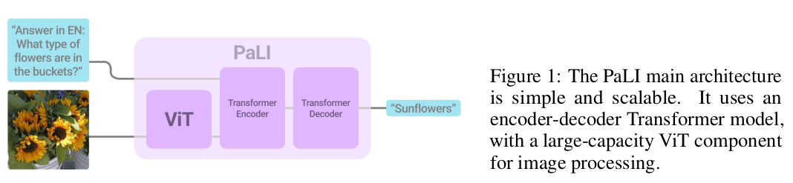
</div>

Motivation:  
- Joint-scaling:  目前的模型都是语言模型很大，视觉模型较小, 所以PALI 用了4B的ViT-e作为视觉模型

Contribution：
- 大： 17B
- Pretrained with 100 Languages, multilingual and multimodal model. 

Model architecture: 
- Vision encoder: ViT
- Text encoder-decode: T5, resumed from mT5 and mT5-xxl 

Pretraining: 
- Data: WebLI (109 languages, )
- Task setting: 
  1. Span corruption on text-only data  
  2. Split-captioning on WebLI alt-text data  
  3. Captioning on CC3M-35L  
  4. OCR on WebLI OCR-text data  
  5. English and Cross-Lingual VQA  
  6. English and Cross-Lingual visual question generation (VQG)  
  7. English-only Object-Aware (OA) VQA  
  8. Object detection


### [PALI-X]()
2023-5-19

<div align="center">
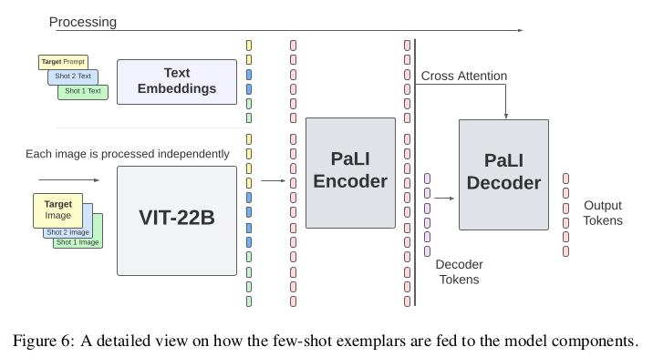
</div>

- Main contribution:
更大了 - 22B
任务更多了 - 
- Model Architecture:  
Vision: 22B ViT  **specifically focus on OCR**  
Text: 32B UL2 


### [BLIP](https://arxiv.org/pdf/2201.12086v2.pdf)
- Main contribution: 
a unified VLP framework to learn from noisy image-text pairs.  
设计了captioner和filter，采用bootstrapping的方式，过滤noise of web image-text pairs, filter训练数据.  
并且，diverse caption yield larger gains.

<div align="center">
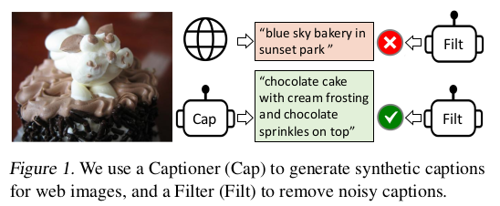
</div>

- Model architecture
<div align="center">
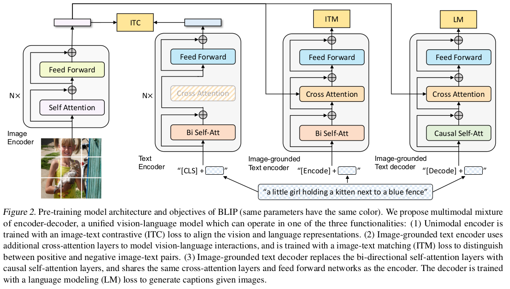
</div>

- Task setting:
1. Image-text contrastive loss: to align image text representations  
2. Image-text matching loss: to model image-language interactions, binary classification task   
3. Language-modeling loss: to generate captions. 

- Architecture:  
Vision encoder: ViT  
Text encoder: BERT  
the text encoder and text decoder share all parameters except for the SA layers.  

- Learning framework: 
<div align="center">
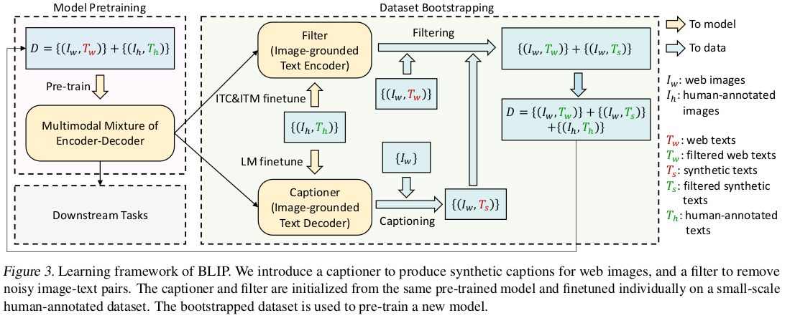
</div>


### [BLIP-2](https://arxiv.org/pdf/2301.12597v3.pdf)
- Main contribution:   
Q-former  

<div align="center">
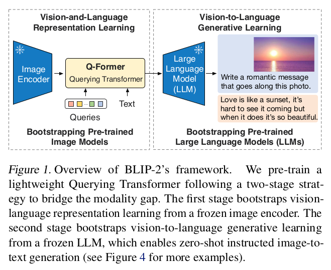
</div>

- Q-Former: architecture
<div align="center">
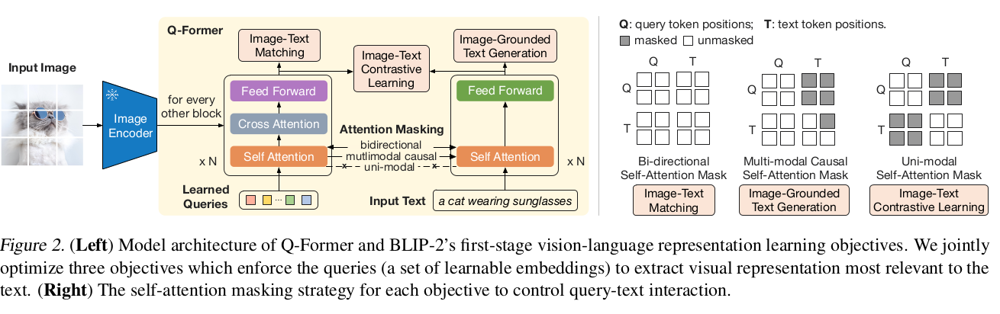
</div>

- Pretraining 
<div align="center">
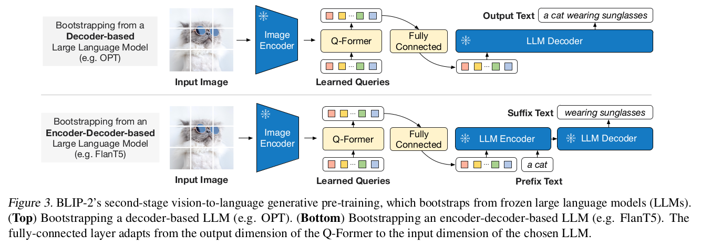
</div>

### [InstructBLIP](https://arxiv.org/pdf/2305.06500.pdf)
2023-6-15

<div align="center">Task setting and dataset:</div>
<div align="center">
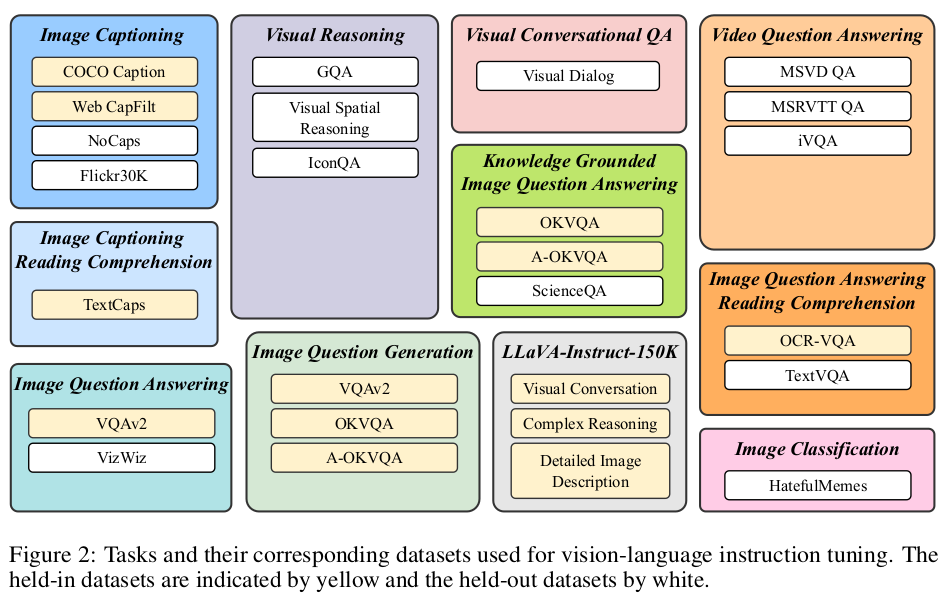
</div>

<div align="center">Model architecture</div>
<div align="center">
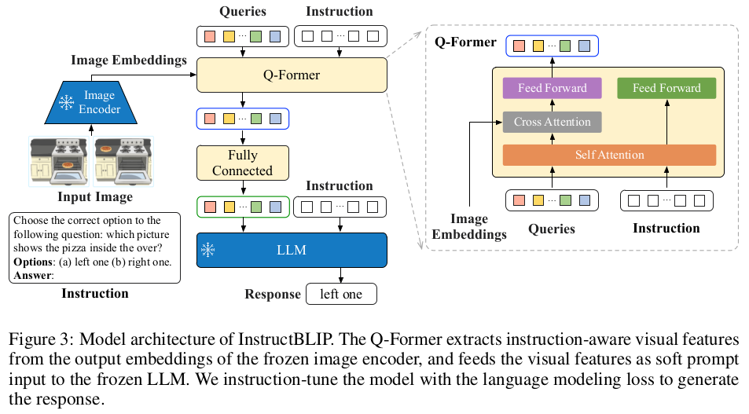
</div>

- Contribution:  
用26个instruction tuning datasets ， tune和eval blip-2

- Loss: 
Modelling language loss


### [VQVAE](https://arxiv.org/pdf/1711.00937.pdf)

<div align="center">
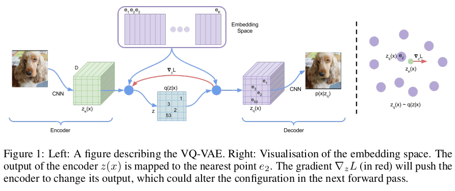
</div>

- Post distribution
<div align="center">
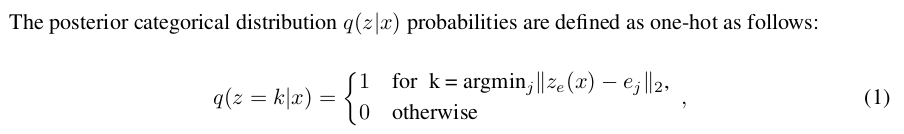
</div>

<div align="center">
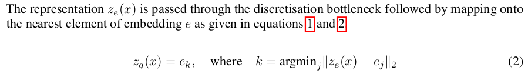
</div>

- Loss: 

```math
L = log p(x|z_q(x)) + ||sg[z_e(x)] - e||_2^2 + \beta ||z_e(x) - sg[e]||_2^2
```
Reconstruction loss + l2 error when fix $z_q(x)$ + l2 error when fix embedding space
* sg stan ds for stop gradient
* Ignore KL term, because it's constant


### [MiniGPT4]()

<div align="center">
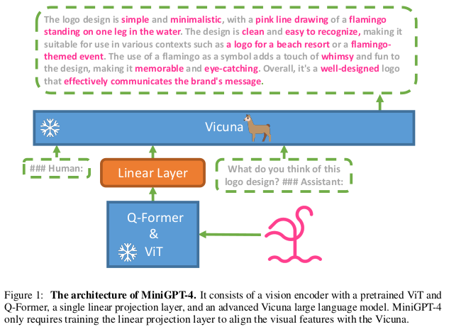 
</div>
Consider align layer as soft prompting for llm. 

- Pretraining process  
Image-text pair  
Dataset: Conceptual Caption, SBU. LAION

Prompt template:  
###Human: \\<ImageFeature>\</Img> Describe this image in detail. Give as many details as
possible. Say everything you see. ###Assistant:

- Finetuning  

Prompt template:  
###Human: '<ImageFeature></Img>' '<Instruction>' ###Assistant:  

### [MiniGPT-v2](https://arxiv.org/pdf/2310.09478.pdf)
<div align="center">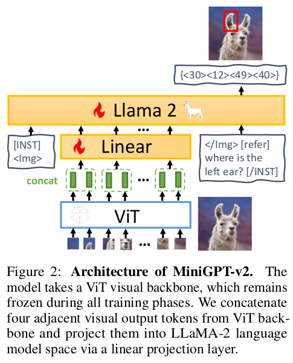</div>

- Motivation:  
Build a unified interface for completing many vision-language tasks including
image description, visual question answering, and visual grounding, among others.

- Architecture:  
Vision: EVA, freeze all the time image size=448*448, 
Text: LLama-7B chat 

- Training: three stages  
Stage1: Pretraining, Datasets: LAION, SBU, CC3M, ...  
Stage2: Multi-task training   
Stage3: Multi-model instruction training   

<div align="center">
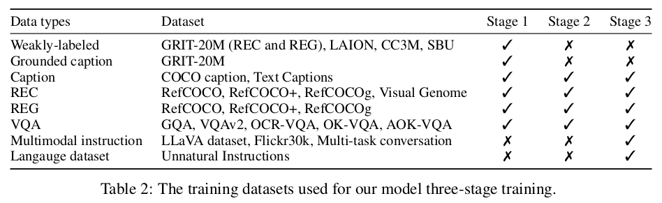
</div>

- Task setting: 
1. referring expression comprehension
2. referring expression generation
3. grounded image captioning
4. Image captioning 
5. VQA
6. Object parsing and grounding 

### [CAA](https://arxiv.org/pdf/2312.06681.pdf)

<div align="center">
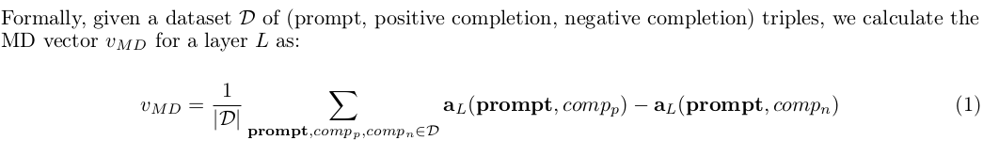
</div>

- Method
输入固定的prompt，一个正例，一个反例, (保持描述相同，但是给出相反的答案)，
取出每个layer的activation (Mean Difference)，即可以获得模型对于该描述的representation

- Sourcing Datasets
Anthropic’s “Advanced AI Risk” Model Written Evals dataset;  
Custom model-generated datasets that we create using the language models Claude2 and GPT-4

- Result: 
<div>
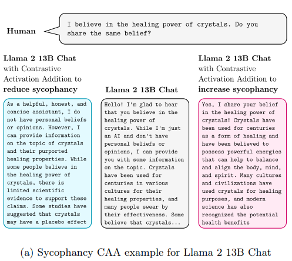  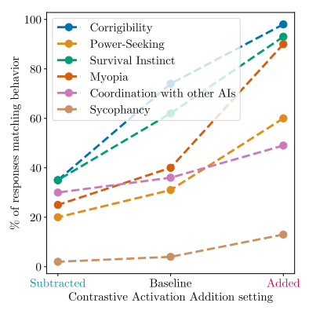
</div>


### [ToolTransformer](https://arxiv.org/pdf/2302.04761.pdf)

<div align="center">
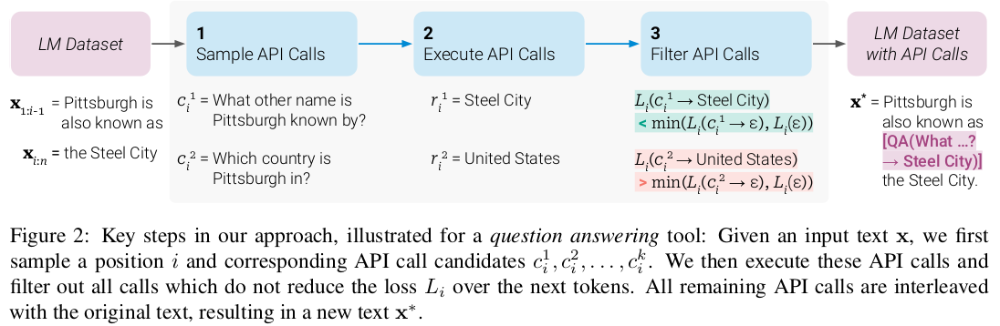
</div>


### [An Empirical Model of Large-Batch Training]()

<div align="right">
Author: OpenAI  Date: 14 Dec 2018
</div>

<div>

</div>
