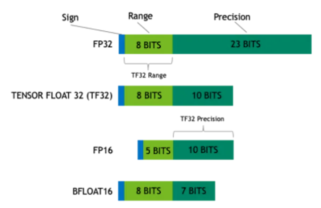
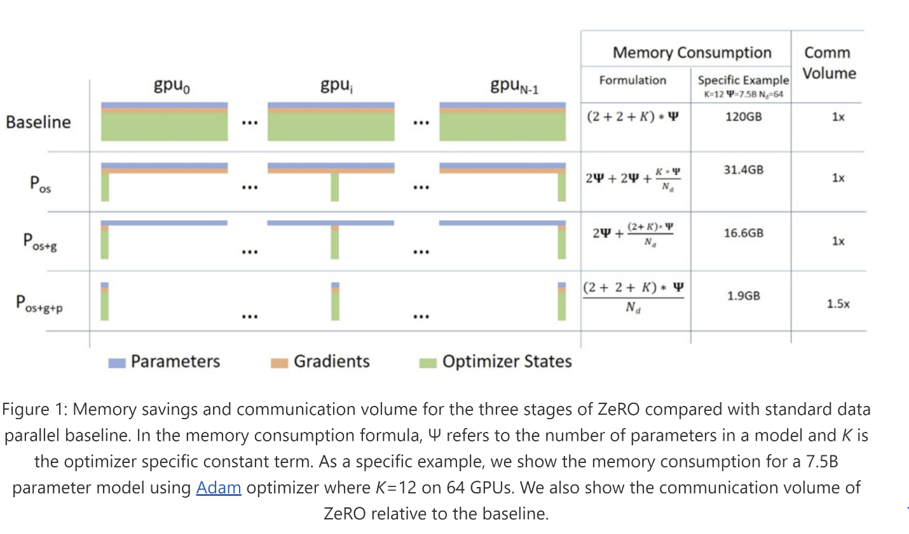
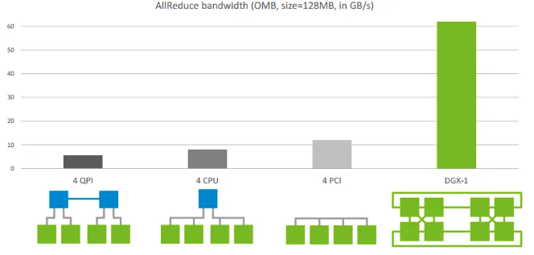

# Model Parallelism
https://huggingface.co/docs/transformers/v4.15.0/parallelism

## 提高单卡计算性能：
- 用 bf16，一般矩阵乘法dot product用bf16，加的时候用float32
- tf32, 19bit, but same dynamic range as float32.
- Use Nvidia Apex fuse AdamW (rewrite the adamw optimizer)
- Use gradient acuumulation, (每train n次，更新一次参数，相当于扩大batch_size)
- 尽量用比较大的batch_size 

### ZeRO       
- Data Parallel

对Megatron的改进:  
- **目前问题**：
  - 模型训练的时候，一般用混合精度，但是混合精度需要把gradient, momentum, variance 拷贝一份 4xbtyes -> 12xbytes
  - Memory fragmentation (pytorch)
  - 

- **改进**： 
  - 把这些中间结果放到一张gpu上，在计算时靠gpu通信获取
  - 每个batch的数据切片，每个gpu只保存一小部分，计算时候再靠gpu通信获取

### Megatron
- Megatron Tflops 可以到40
- 只能做到8卡，扩展更多需要引入data parallel
- 

### Gpipe

## Communication primitive
- P2P communication (point-to-point communication): 一个sender, 一个receiver
- collective communication (broadcast, gather, all-gather, reduce, all-reduce...)
  
Reduce：从多个sender那里接收数据，最终combine到一个节点上
All-reduce：从多个sender那里接收数据，最终combine到每一个节点上

