# Openset Recognition

## Problem settings
Given a labeled training set of $X \in R^{m \times n}$, labels $y \in \{1, ..., k\}^n$, where the $k$ is the number of known classes. 

The goal is to find a model $f : X \to \{1,... k + 1\}^n$ that the model accurately classify an unseen instance to one of the $k$ classes or an unknown class indexed by $k+1$

$$
Openness = 1 - \sqrt{\frac{k_{train}}{k_{test}}}
$$
 where the $k_{train}$ and  $k_{test}$ are the number of classes in the training set and the test set, respectively. 

* Relationship between novelty detection, open-set recognition and out-of-distribution

<div align="center">

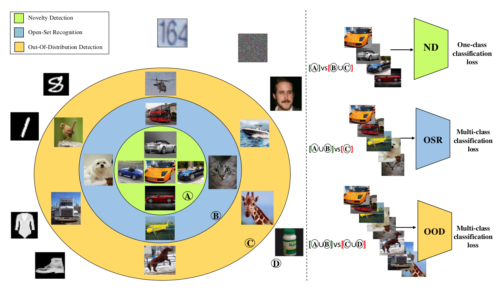

</div>

## Overview

<div align="center">
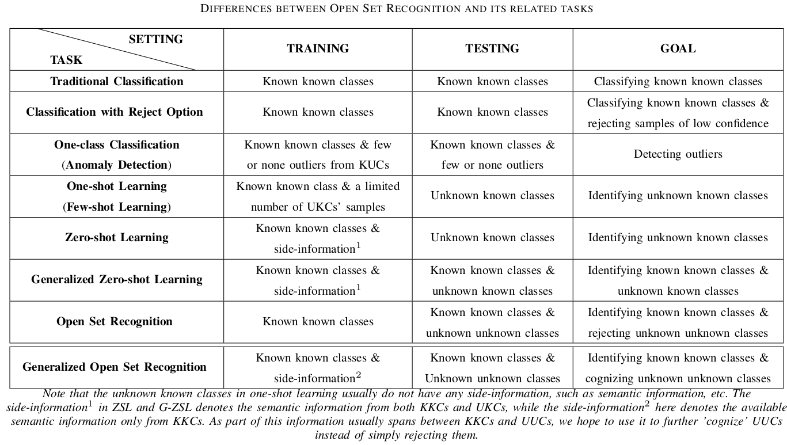
</div>

### Generative model

* [Towards Open-set Deep Neural Networks](https://arxiv.org/pdf/1511.06233v1.pdf)

* [LOTS: Adversarial Robustness: Softmax versus Openmax](https://arxiv.org/pdf/1708.01697.pdf)

LOTS: 
$$
\eta^{(L-1)} (x_o, t) = \bigtriangledown_{x_o} (\frac{1}{2} || t - f^{L-1}(x_o)||^2)
$$


### Discriminative model

* [Two transformer](https://arxiv.org/pdf/2112.04185v2.pdf)  
teacher-student model

<div align="center">

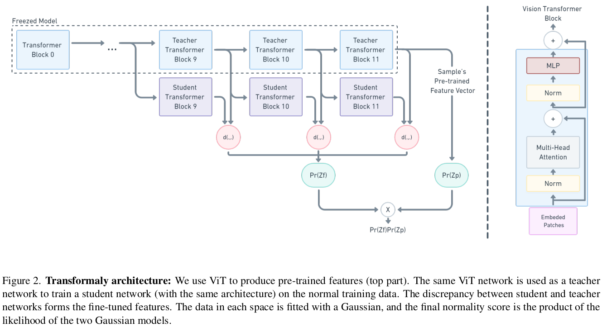

</div>


* [Exploring the limits of OOD detection](https://arxiv.org/pdf/2106.03004v3.pdf)

Current SOTA

[Code](https://github.com/stanislavfort/exploring_the_limits_of_OOD_detection)

[ViT](https://github.com/google-research/vision_transformer)

<div align="center">

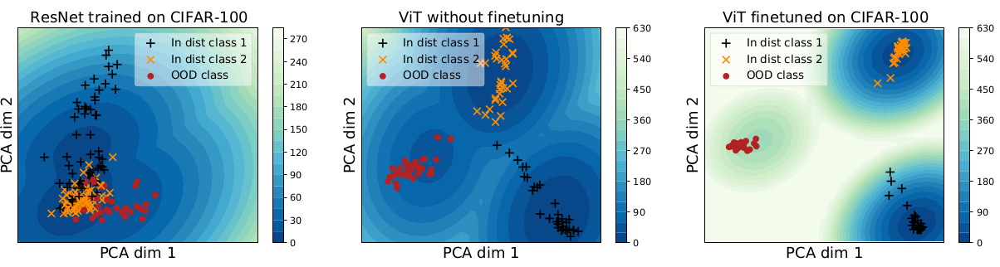

PCA result of different backbone features

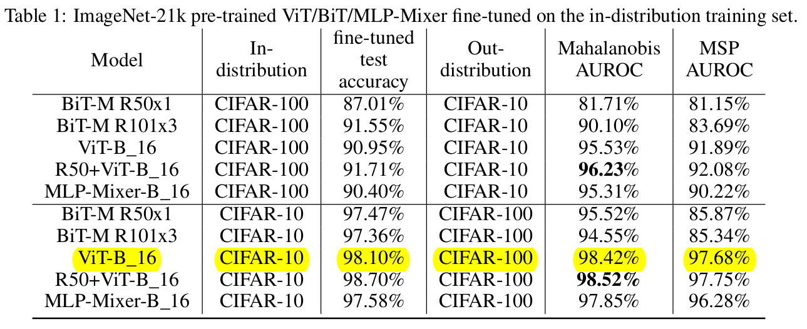

Result of ViT finetuned on CIFAR10

</div>

#### Method
- Baseline: Maximum over softmax probabilities (MSP)
- Mahalanobis Distance
- Outlier Exposure

* [NCM](https://arxiv.org/pdf/1807.03888.pdf)

[Code](https://github.com/pokaxpoka/deep_Mahalanobis_detector)

<div align="center">

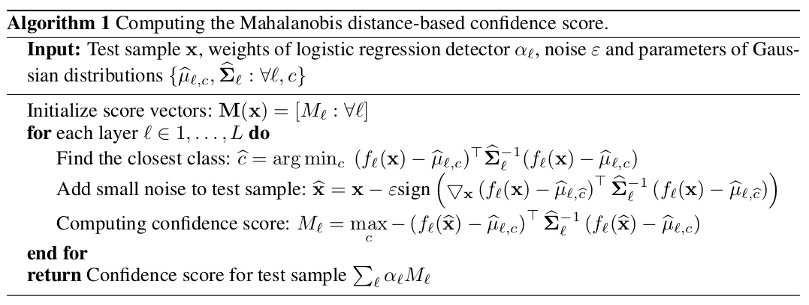

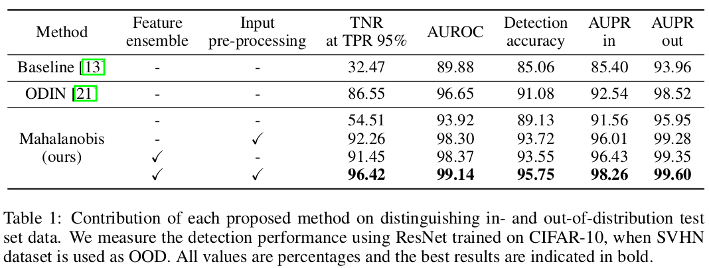

</div>

* [ODIN](https://arxiv.org/pdf/1706.02690.pdf)

#### Temperature scaling:

Neural network: $\mathbf{f} = (f_1, ..., f_N)$

For each input $x$, the neural network assigns a label $\hat{y} = argmax_i S_i(\mathbf{x}; T)$ by computing softmax output:
$$
S_i(\mathbf{x};T) = \frac{exp(f_i(\mathbf{x}/T))}{\sum_{j=1}^N exp(f_j(\mathbf{x}/T))}
$$
where $T \in R^+$ is the temperature scaling parameter and set to 1 during the training. 


#### Input preprocessing:

In addition to temperature scaling, a small perturbations is added to the input; 
$$
\mathbf{\tilde{x}} = \mathbf{x} - \varepsilon sign(-\bigtriangledown_x log S_{\hat{y}}(\mathbf{x};T))
$$


where the $\varepsilon$ is the perturbation magnitude. 

* [Outlier exposure](https://arxiv.org/pdf/1812.04606v3.pdf)

[Code](https://github.com/hendrycks/outlier-exposure)

```math
E_{(x, y)\sim D_{in}}[L(f(x), y) + \lambda E_{x' \sim D_{out}^OE}[L_{OE}(f(x'), f(x), y)]]
```

* [Contrastive training for improve OOD detection](https://arxiv.org/pdf/2007.05566.pdf)

<div align="center">

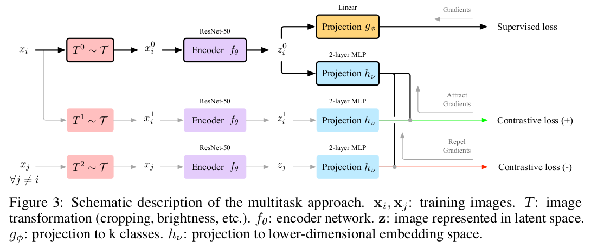

</div>

Architecture just like SimCLR  
**Aim**: 鼓励判别器$f$学到尽可能多的深层（high-level）、任务无关（task-agnostic）的语义特征。这样就可以在测试时识别任意类型的OOD样本。

**Density estimation to represent OOD:**
```math
s(x) = max_c [-(f_{\theta}(x) - \mu_c)^T \Sigma_c^{-1} (f_{\theta}(x)-\mu_c) - log((2\pi)^n det \Sigma_c)]
```

**Confusion Log Probability (CLP) as a Measure of Dataset Distance**

Given dataset $D_{in}$ and $D_{out}$, train an ensemble $N_e$ classifiers $\{\hat{p}^j\}_{j=1}^{N_e}$

The expected probability of a test sample $x$ to be predicted as class $k$ is given by:
```math
c_k(x) = \frac{1}{N_e} \sum_{j=1}^{N_e} \hat{p}^j (\hat{y} = k |x)
```
  
The confusion log probability of $D_{test}$ becomes: 
```math
CLP_{C_{in}}(D_{test}) = log(\frac{1}{|D_{test}|} \sum_{x \in D_{test}} \sum_{k \in C_{in}} c_k(x))
```
A low CLP indicates that test samples are far OOD and a high CLP indicates that they are near OOD.

- **Near-OOD dataset** : $D_{in}$ = CIFAR-100  $D_{out}$ = CIFAR-10  CLP=[-4.5 to -2.6]
- **Near & Far OOD** : $D_{in}$ = CIFAR-10  $D_{out}$ = CIFAR-100  CLP=[-7.4 to -0.8]
- **Far OOD** : $D_{in}$ = CIFAR-10  $D_{out}$ = SVHN  CLP=[-12.1 to -7.6]


**Experimental results**: 
<div align="center">
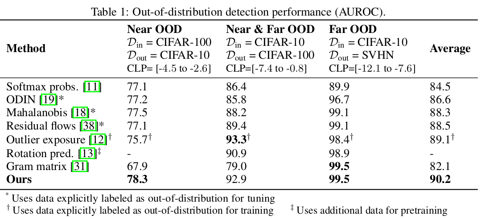
</div>


### Hybrid

* [OpenHybrid](https://arxiv.org/pdf/2003.12506v2.pdf)
<div align="center">

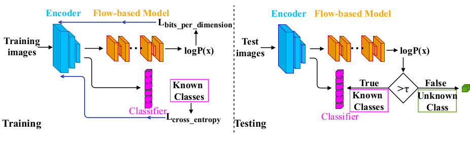

</div>

use $P(x)$ as abnormal score


* [Fake it till you make it](https://arxiv.org/pdf/2205.14297v1.pdf)

[Code](https://github.com/rohban-lab/FITYMI)

<div align="center">
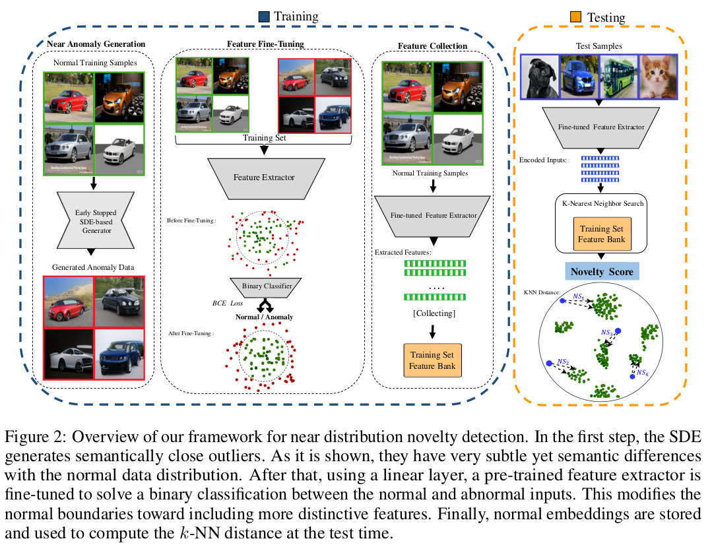
</div>

**Step 1: Near anomaly genration**

SDE-based model (stochastic differential equation)

The procedure that gradually transforms a data point into random noise is controlled by a pre-determined stochastic 
differential equation that does not contain any trainable parameters. Finally, inverting this process allows us to 
seamlessly transform random noise into the data that could be used for sample generation as follows:
```math
x_{n-1} - x_n = [f(x, t) - g^2(t) \bigtriangledown_x logp_t(x)]dt + g(t)d\hat{w} \\
x_T \sim N(0, 1)
```
where f and g are called the drift and diffusion coefficients respectively


