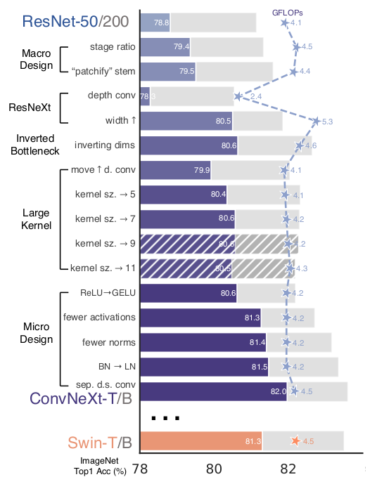

# Representation

* [ConvNext](https://arxiv.org/abs/2201.03545)

- Optimizer:
  - AdamW, training epoch 90 -> 300, acc: 76.1% -> 78.8%
  - lr=4e-3, weight_decay=0.05, batch_size=4096
  - finetune lr=5e-5, weight_decay=1e-8, batch_size=512, layer-wise lr decay
- Macro design: 
  - Conv block: [3, 4, 6, 3] -> [3, 3, 9, 3] (adapted from Swin Transformer), acc 78.8% -> 79.4%
  - Patchify layer kernel_size=7, stride=2 -> kernel_size=4, stride=4 (adapted from Swin Transformer, changed it to \ 
   nonoverlap 4x4 patches), acc 79.4% -> 79.5%
    (suggested that the stem cell can be substituted with a simpler 'patchify' layer like in ViT)
  - Used depth-wise conv with same channel number 96 instead of 65, acc -> 80.5%, FLOPS increased to 5.3G
  - BottleNeck -> inverted BottleNeck acc: 80.5% -> 80.6%, FLOPS increased to 4.6G
  

- Micro design:   
  - Replace ReLU with GELU: acc remain 80.6% (reason: GELU has been widely used in advanced Transformers)
  - Fewer activation functions: because a transformer block with k/q/v linear embedding layers, there is only one \ 
  activation function present in MLP block, therefore, all GELU layers are eliminated from the residual block except for \
  the one between two 1x1 conv layers, to replicate the style of Transformer block. 
  acc: 80.6% -> 81.3%
  - Fewer normalization layers: the reason is the same as the activation function. acc: 81.3% - 81.4%
  - Substitute BN with LN: same reason. acc: 81.4% -> 81.5% ( # TODO: ?why)
  - Separate downsampling layers: in Swin transformer, a downsampling layer is added between stages. Plus they found adding \ 
  normalization layers wherever spatial resolution is changed can stablize training. 
  acc: 81.5% -> 82.0%
  - 
  - 
