# Time Series Anomaly Detection

## Overview

- Time-series sequence data

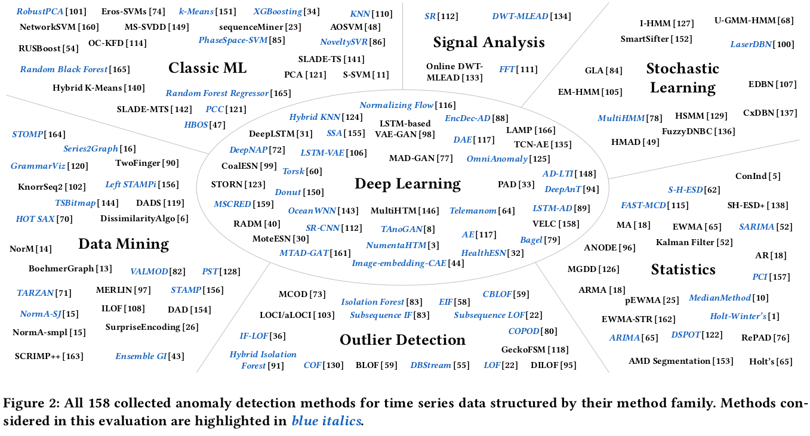

- Surveillance video

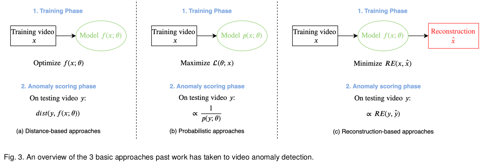

## Benchmark

- Time-series  
  univariate: [Numenta Anomaly Benchmark (NAB)](https://arxiv.org/pdf/1510.03336.pdf)

  [eSports Sensors Dataset](https://arxiv.org/pdf/2011.00958v2.pdf) 

  - Hand/head/chair movements.
  - Heart rate.
  - Muscle activity.
  - ...

- Surveillance Videos  
[CUHK Avenue](http://www.cse.cuhk.edu.hk/leojia/projects/detectabnormal/dataset.html)  
[UCF-Crime](https://webpages.charlotte.edu/cchen62/dataset.html)    
[ShanghaiTech](https://svip-lab.github.io/dataset/campus_dataset.html)    
UCSD Peds    

## Papers

### Sequence data

- [HTM AL](https://reader.elsevier.com/reader/sd/pii/S0925231217309864?token=EAD20E3A3E8AC4A657F6DC16EF27DBB770A6C03A7F80D42F7C38DD04B1800356CBCF0BE2D8D5CEF7BCD817CC37D7B255&originRegion=us-east-1&originCreation=20221008061103)

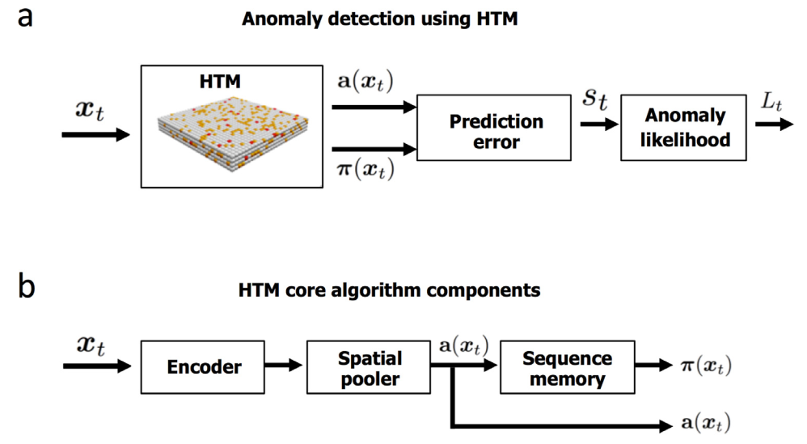

Sparse distributed representations(SDR)  
Random-Spatial Pooling (Random-SP)  

### Surveillance video

#### Multi-task learning based

- [SSMTL](https://openaccess.thecvf.com/content/CVPR2021/papers/Georgescu_Anomaly_Detection_in_Video_via_Self-Supervised_and_Multi-Task_Learning_CVPR_2021_paper.pdf)

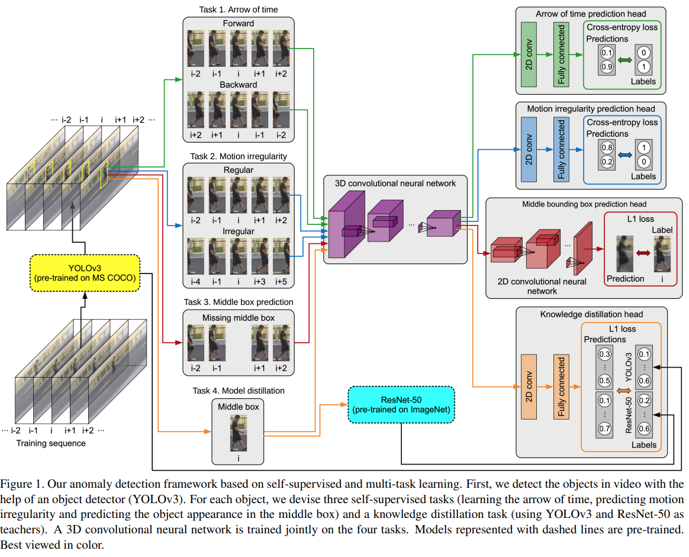

- [SSMTL++](https://arxiv.org/pdf/2207.08003.pdf)

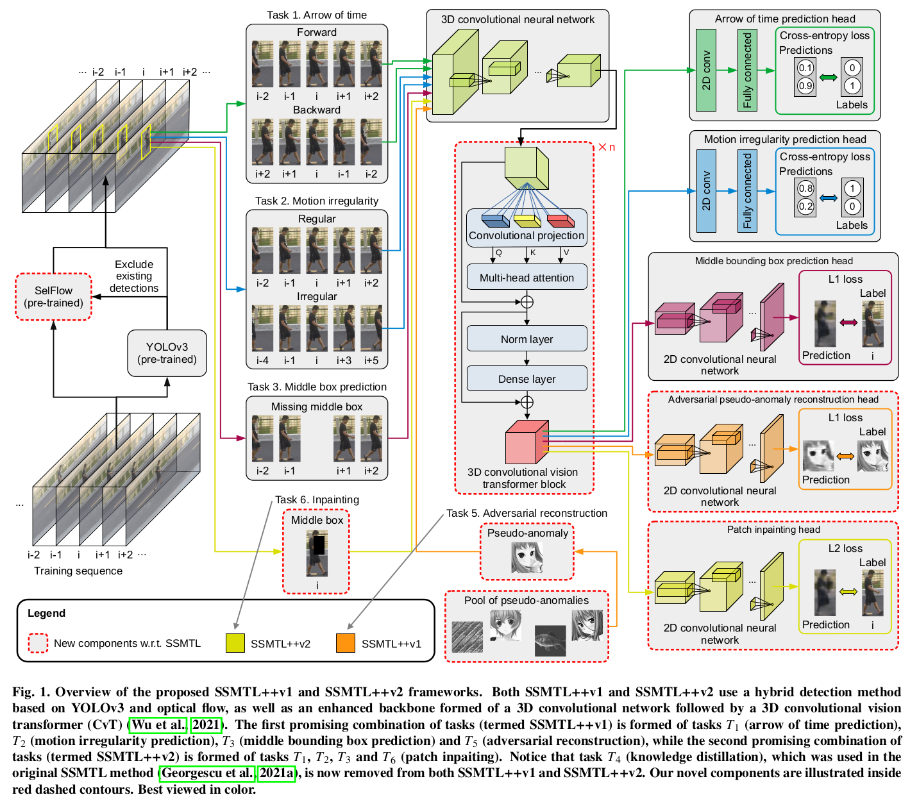

#### Autoencoder-based

- [MPED-RNN](https://openaccess.thecvf.com/content_CVPR_2019/papers/Morais_Learning_Regularity_in_Skeleton_Trajectories_for_Anomaly_Detection_in_Videos_CVPR_2019_paper.pdf)

* Motion Decomposition:

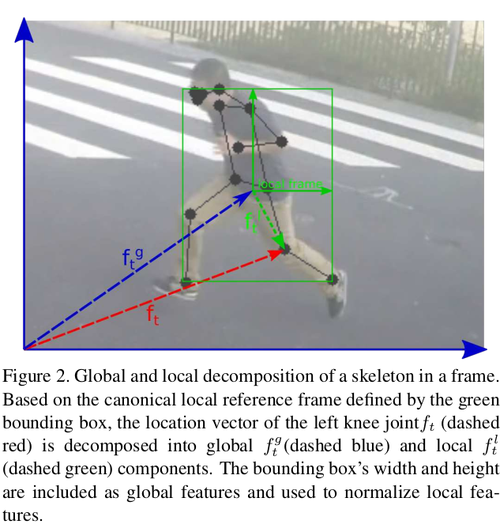

* Architecture

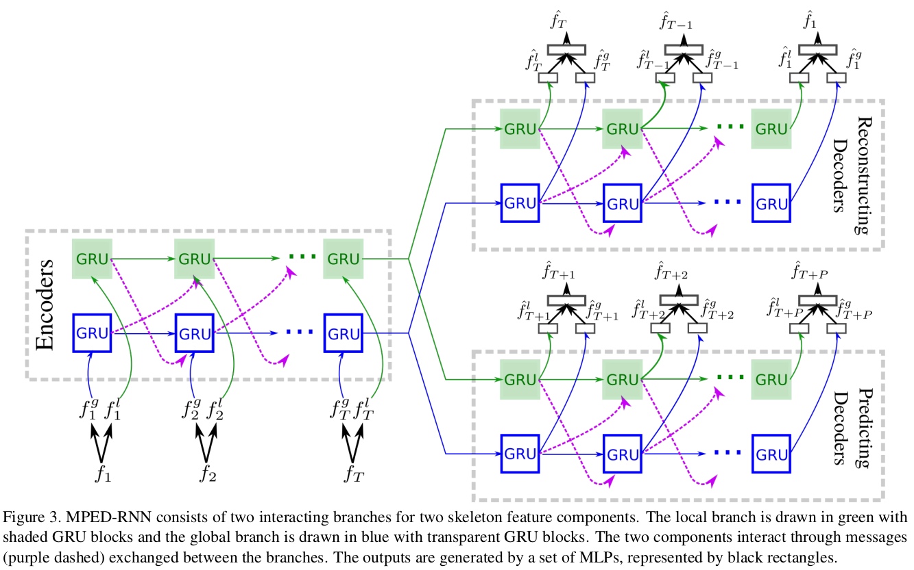

* Loss

$$
L_*(seg_i) = \frac{1}{2}(\frac{1}{T} \sum_{t=b_i}^{e_{i}}||\hat{f^*_t} - f^*_t||^2_2 + \frac{1}{P} \sum_{t=e_i+1}^{e_i+P} ||\hat{f^*_t} - f^*_t ||^2_2)  \\
  
  L(seg_i) = \lambda_g L_g(seg_i) + \lambda_lL_l(seg_i) + \lambda_pL_p(seg_i)
$$

- [Multi-timescale Trajectory Prediction for Abnormal Human Activity Detection](https://rodrigues-royston.github.io/Multi-timescale_Trajectory_Prediction/)

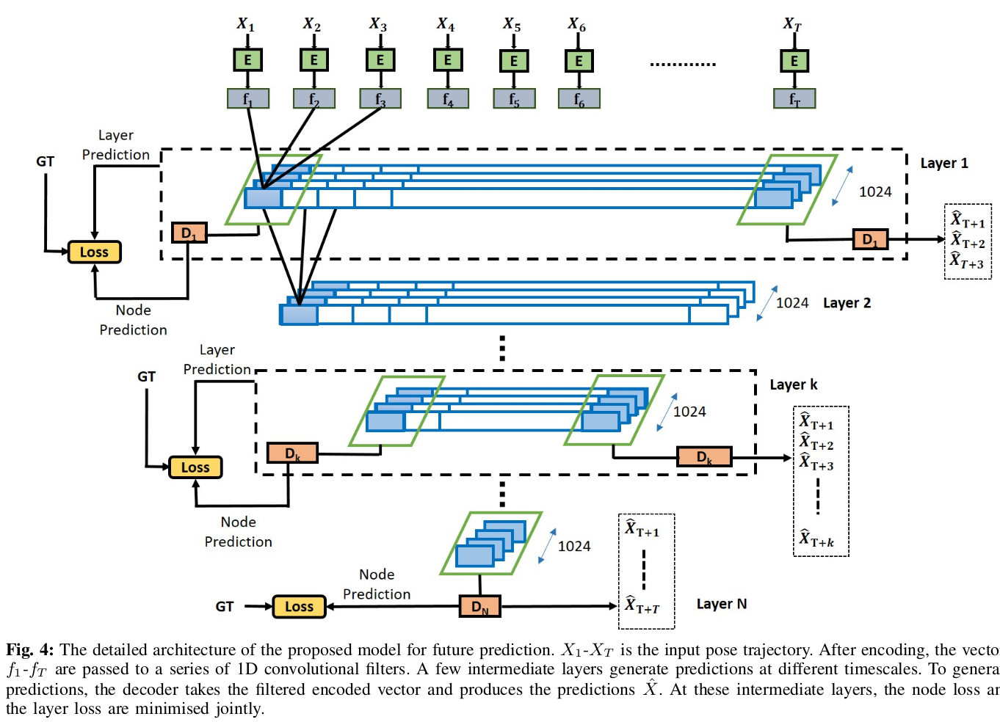

* anomaly detection: Reconstruction error

#### Clustering-based

- [Graph Embedded Pose Clustering for Anomaly Detection](https://arxiv.org/pdf/1912.11850.pdf)

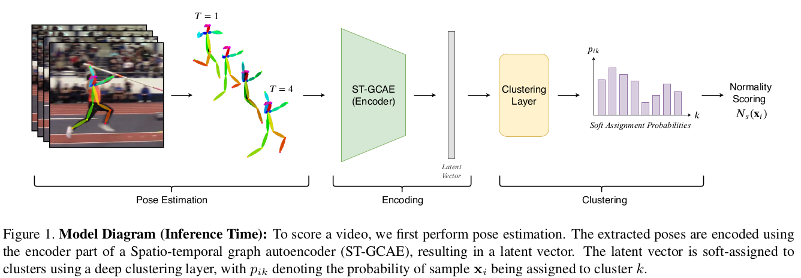
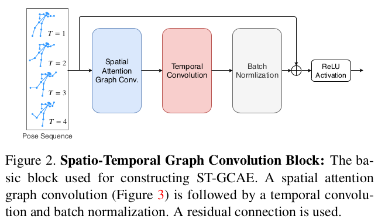
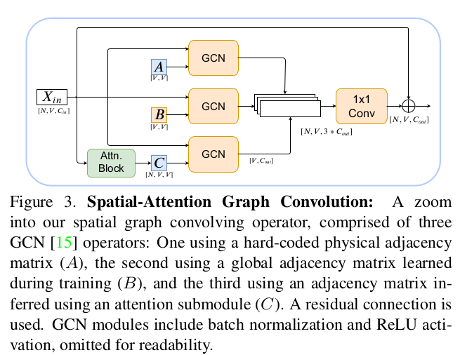

