## Agent Memory

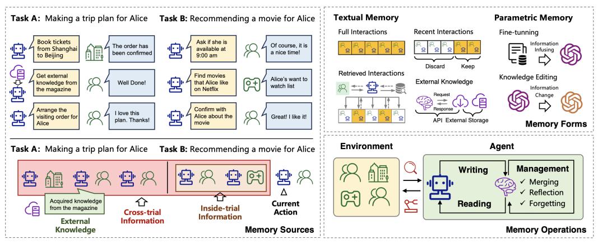

Overview

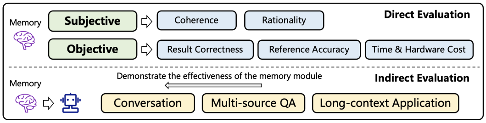

### Evaluation 
- Subjective: Coherence & rationality
- Objective: Result correctness (Dataset: chatdb, MemGPT); Retrieval accuracy (Dataset: Memochat, Memorybank)
- Engagement of response: (SCE-p [Prompted llms] Sensibleness, Consistency, Interestingness, Preference & CSIM [MemGPT])
- Long-context: ROUGE

#### [ChatDB]()

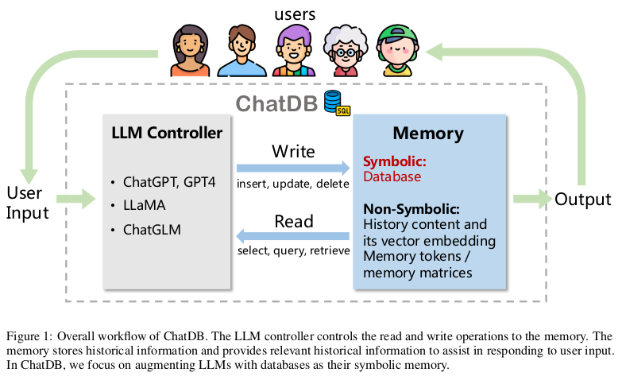

Overview

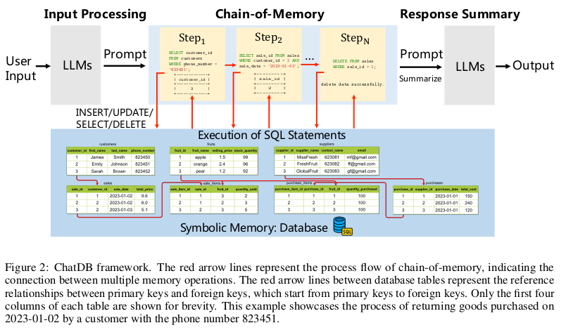

ChatDB Framework

Contributions: 
- Involved Database to store chat history, 
and LLM controller controls the read and write operations to th memory. 
- CoM: propose chain of memory, decompose tasks into multiple steps
- Comparison between chatDB and other memory modules:

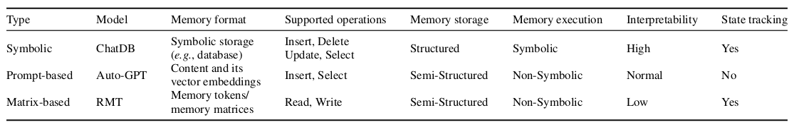

1. Memory format: Structured SQL  
2. Supported operations: 增删改查  
3. Memory storage: SQL  
4. Memory execution: symbolic storage, while autoGPT use vector embedding.
5. Interpretability
6. State tracking

#### [SCM](https://arxiv.org/pdf/2304.13343.pdf)

Author: Beihang Date: 15 Feb 2024

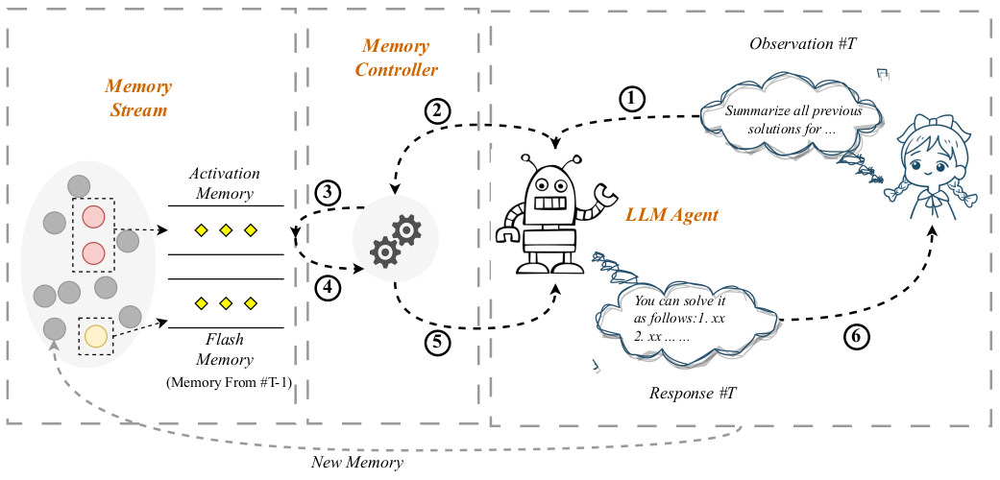

- Method:
1. LLM-based agent
2. Memory stream: redis or Pinecone vectorstore:
   each memory contains:   
   a. An interactive index.  
   b. an observation (User query?)  
   c. system response.  
   d. memory summarization  
   e. embedding.  
3. Memory controller: responsible for memory organi*zation, use the original or the summary of the memory. 
4. Memory retrieval: Recency and relevancy, rank_score = recency_score + relevance_score.

- Data: Train data & eval data: 
- Memory store format?  Redis or Pinecone
- Metric:
  1. Answer accuracy
  2. Memory retrieval recall
  3. Single-turn accuracy
  4. Multi-turn accuracy
5. 

#### [ExpeL](https://arxiv.org/pdf/2308.10144.pdf)

Author: Tsinghua Date: 12 Dec 2023

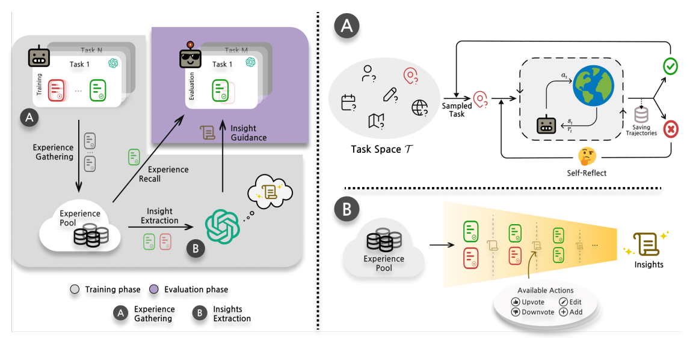

- Contribution: 
1. Let Agents autonomously learn from experience without gradient update. 

- Method: 
1. Training stage: agent interact with environment, get experience with trial and error. 
2. Learn from experience: a. add insights to prompt. b. Retrieval few relevant examples as few-shot prompt. 
3. FAISS vectorstore to store experience pool, KNN retriver
4. To get experience: a. compare the failure traj with successful traj. b. identify patterns in successful traj.

#### [GITM]()

Author: 

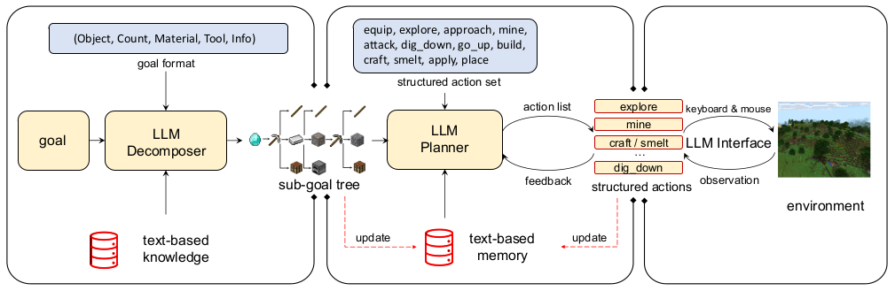

Framework

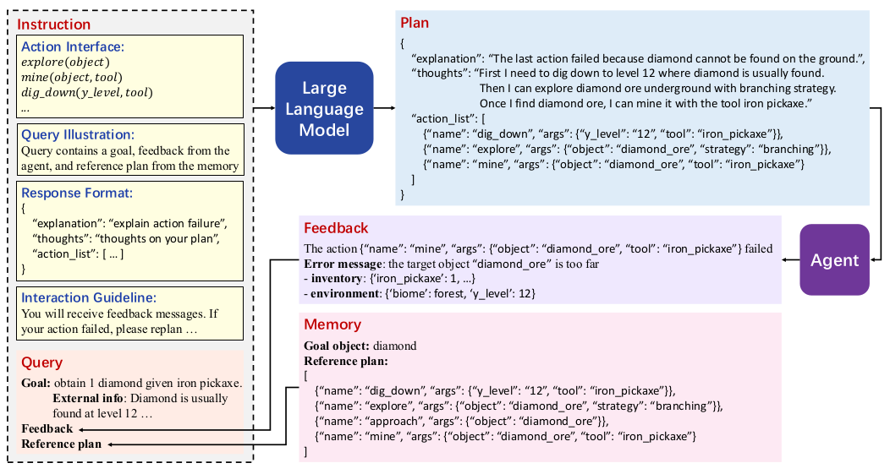

Planning process

#### [MemGPT](https://arxiv.org/pdf/2310.08560.pdf)

Author: UC Berkeley Date: 12 Feb 2024

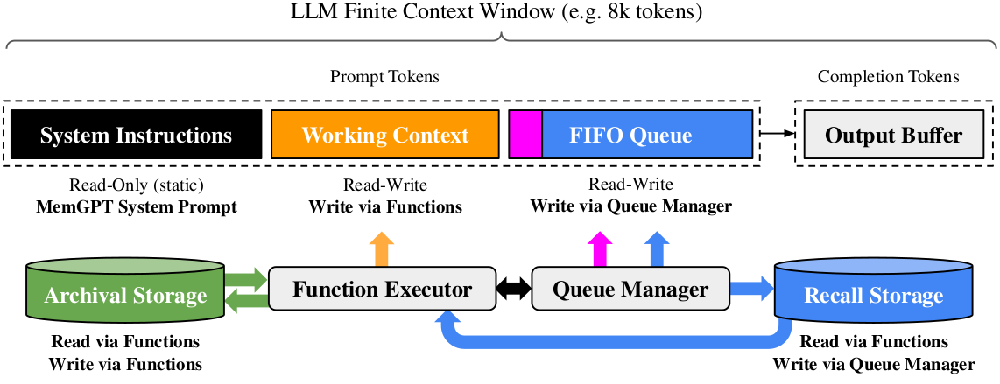

- Method: 
作者参考了operating system的memory设计，把memory分成两部分：
1. Main context (RAM): system instruction, working context, FIFO queue
2. External context (Disk memory):

#### [MemoryBank](https://arxiv.org/pdf/2305.10250.pdf)

Author: Wanjun Zhong Date: 21 May 2023

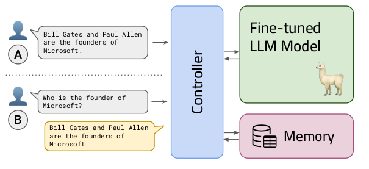
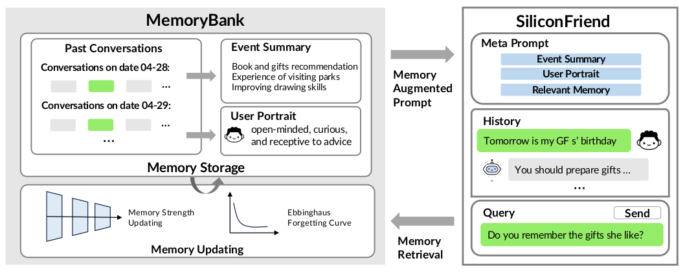
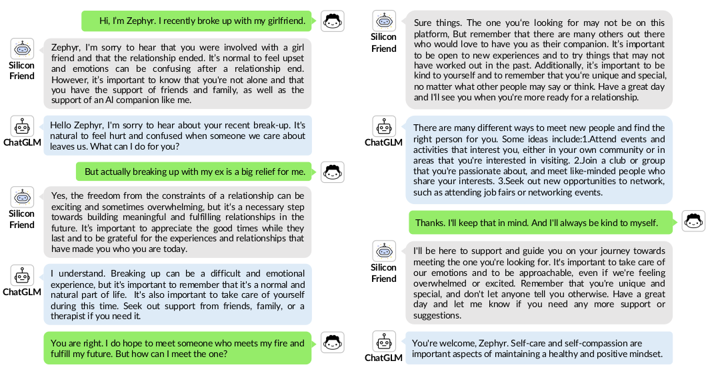

- Method: 
1. Update memory according to Ebbinghaus Forgetting Curve. 
2. Memory bank:
   - In-Depth Memory Storage: store conversation according to timestamp
   - Hierarchical Event Summary: summarize daily event, provide a bird's eye view of past event. (可以以session为单位进行总结，作为整个session的key)
   - Dynamic Personality Understanding: summarize user's personality. 
3. Memory retrieval: FAISS store, use a dual-tower dense model.
4. Parameter-efficient Tuning with Psychological Dialogue Data:

#### [InterRecAgent](https://arxiv.org/pdf/2308.16505.pdf)

Author: UCST Date: 30 Jan 2024

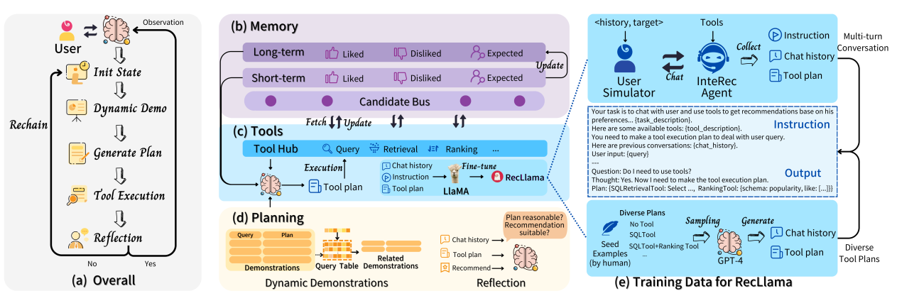

- Method: 
1. Framework
2. Memory Mechanism
3. User profile: like, dislike, expect
4. Demonstration:   
Input-first, output-first two strategies, output-first is given llm a plan, llm generate user instruction.

- Evaluation: 

#### [MAC](https://arxiv.org/pdf/2403.04317)

Author: KAIST Date: 7 Mar 2024

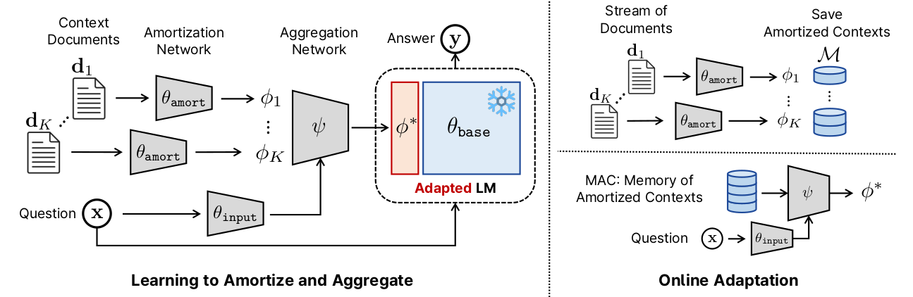

#### [MPC](https://arxiv.org/pdf/2305.04533)

Author: KRAFTON Date: 8 May 2023

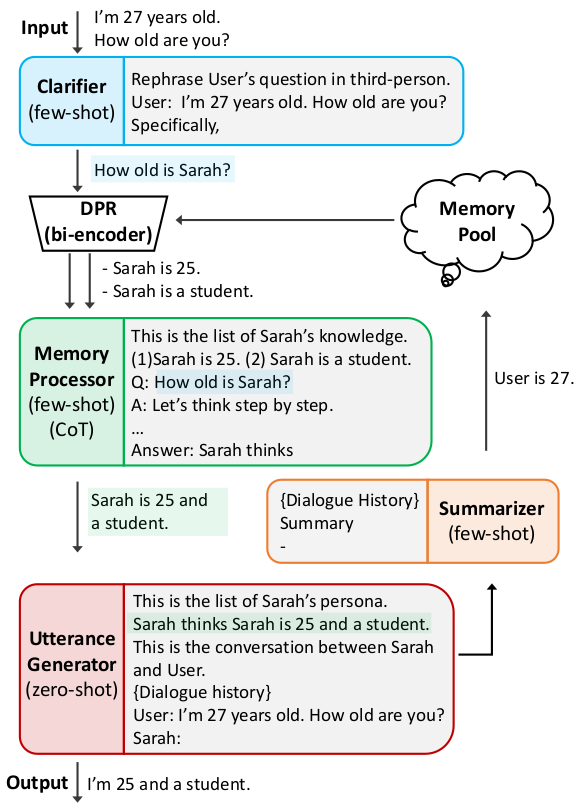

#### [RET-LLM](https://arxiv.org/pdf/2305.14322)

Author: LMU Munich  Date: 23 May 2023

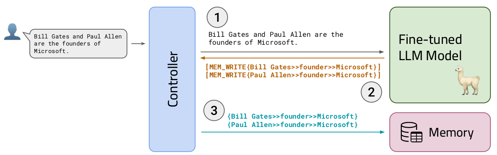

Memory write

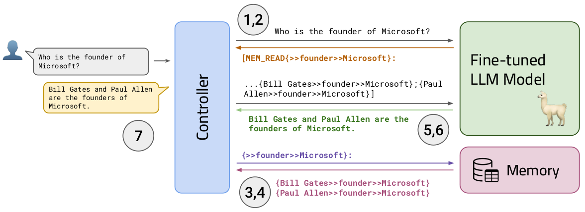

Memory read

Method: 
1. Memory structure: {first argument, relation, second argument} 
2. finetuned LLM write function calls for memory reading and writing. 
3. Use LSH (Locality-sensitive Hashing) store memory

#### [Generative Agents]()

Author: Stanford Date: 6 Aug 2023

1. Memory:   
Recency - Exponential decay function  
Importance - rating by model itself  
Relevance - cosine similarity  
Stored item: observation, reflection, planning

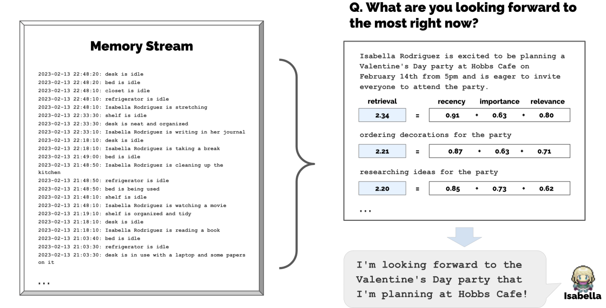

2. Reflection:
Reflect when the sum of the importance scores exceed a threshold

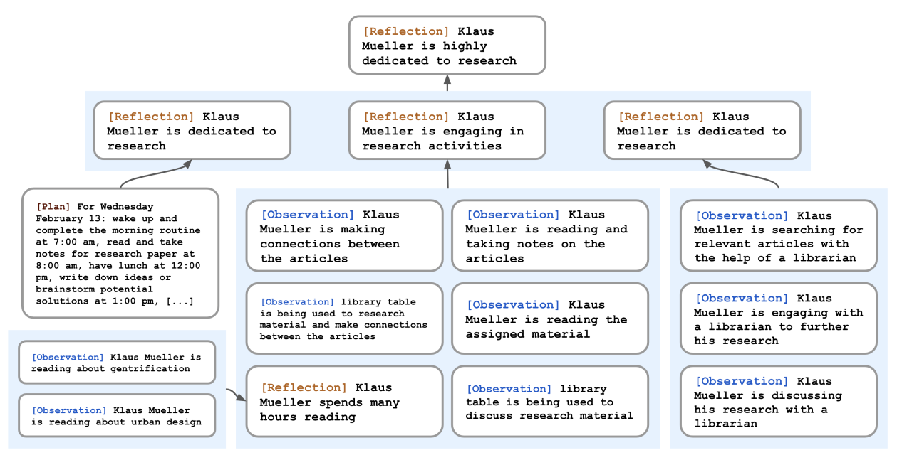

#### [TiM]()

author: Ant Group  Date: 15 Nov 2023

- Method:
1. Stage 1: Recalling 
Memory stored as Triplet. Use LSH, and similarity to retrive. 
2. Stage 2: Post-think and update
Updating includes: insert, merge, forget

#### [RecMind](https://arxiv.org/pdf/2308.14296)

Author: Arizona State University & Amazon  Date: 20 Mar 2024

 
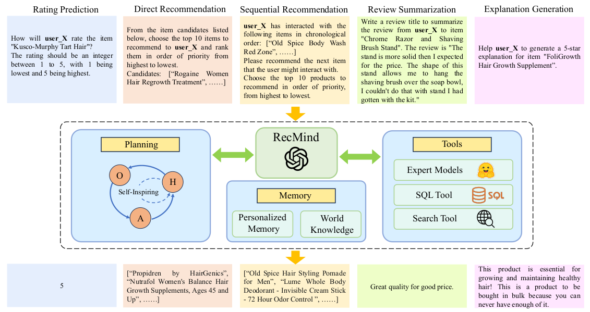

Overview

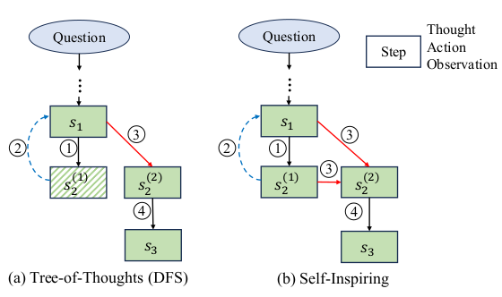

Planning

- Contribution: 
主要是提出了 Self-inspire 的planning方法
Memory store Personalized Memory * World Knowledge

#### [RecAgent](https://arxiv.org/abs/2306.02552)

Author: Remin University  Date: 15 Feb 2024

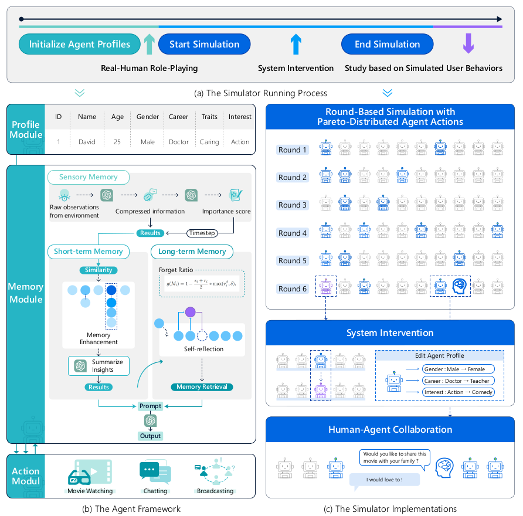

- Method: 

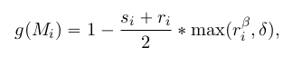
Probability of forgotten memory

#### [Synapse]()

- Contribution:
1. 主要解决三个问题：
Long-context, exemplars in long-horizon tasks, exemplars based on similarity cannot be generalized.

#### [AI-native Memory](https://arxiv.org/html/2406.18312v2)

Author: Mindverse AI Date: 19 Jul 2024

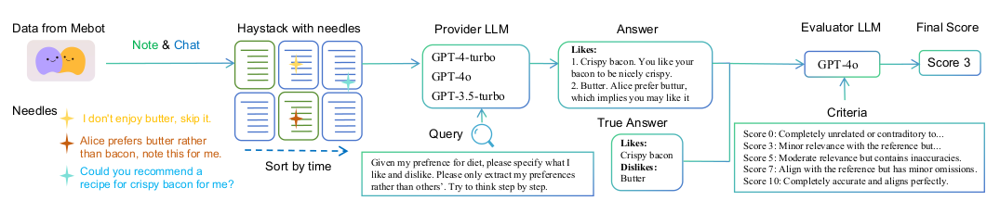

- Contribution: 
1. 作者认为目前的LLM声称可以有无限长的context-length，但实际并不是都有效的，比如ChatGLM声称128k实际只有4k，GPT4声称128k实际只有64k有效。
2. 如果想要仅通过infinite context-length实现AGI，需要满足**两个假设**：
- Needle-in-a-haystack task
- Reasoning-in-a-haystack task, 即在context-length 很长的时候进行reasoning任务

#### [Memory3](https://arxiv.org/pdf/2407.01178)

Author: Moqi & Beijing University Date: 1 Jul 2024

#### [K-LaMP](https://arxiv.org/abs/2311.06318)

Author: KAIST & Microsoft  Date: 19 Feb 2024 

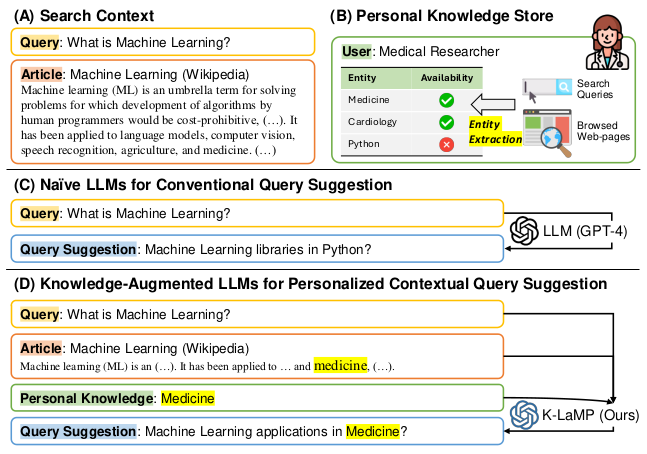

- Contribution:
1. 通过从用户与搜索引擎的交互历史中增加相关上下文来个性化其输出，从而增强LLM
2. 