## Agents

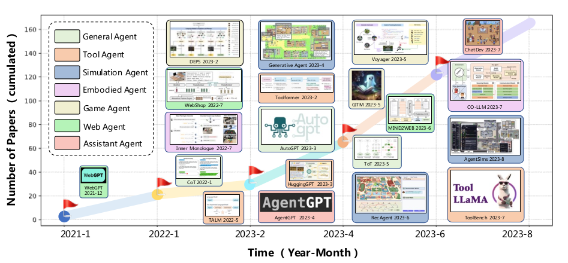

Overview

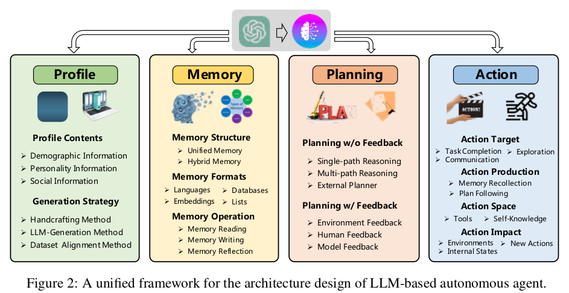

Framework

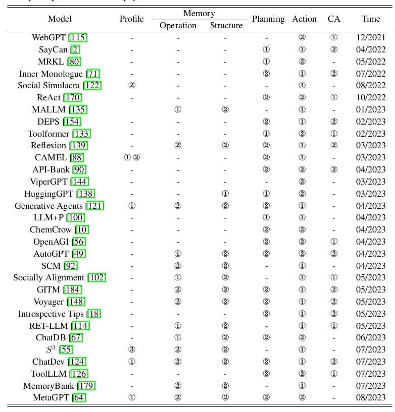

### Profile
### Memory Module  
[Generative Agent] [DB-GPT] [GITM] [RLP]  
Memories that are more recent, relevant, and important are more likely to be extracted.  
- Structure: Short-term or long-short term memory
- Format: Language/Database/Embedding/Structured Lists
- 

### Planning
[CoT] [ToT] [AoT] [HuggingGPT] [ReAct]  
- Single-path reasoning
- Multi-path reasoning

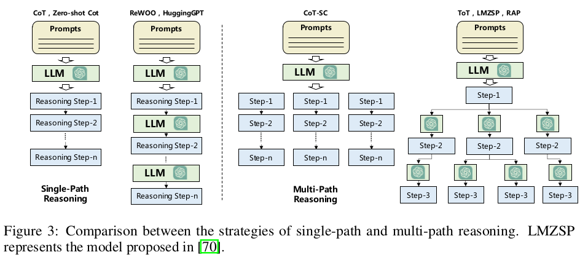

### Action
- APIs
- Databases & Knowledge Bases
- External Models

### Finetuning: 
Mechanism engineering:  
1. Trial-and-error
2. Crowd-sourcing
3. Experience Accumulation
4. Self-driven Evolution
5. Remark

### Prompting:
**RAG**   
LLM 面临的已知挑战包括：

1. 在没有答案的情况下提供虚假信息。
2. 当用户需要特定的当前响应时，提供过时或通用的信息。
3. 从非权威来源创建响应。
4. 由于术语混淆，不同的培训来源使用相同的术语来谈论不同的事情，因此会产生不准确的响应。

RAG 引入了一个信息检索组件，该组件利用用户输入首先从新数据源提取信息。用户查询和相关信息都提供给 LLM。LLM 使用新知识及其训练数据来创建更好的响应。以下各部分概述了该过程。

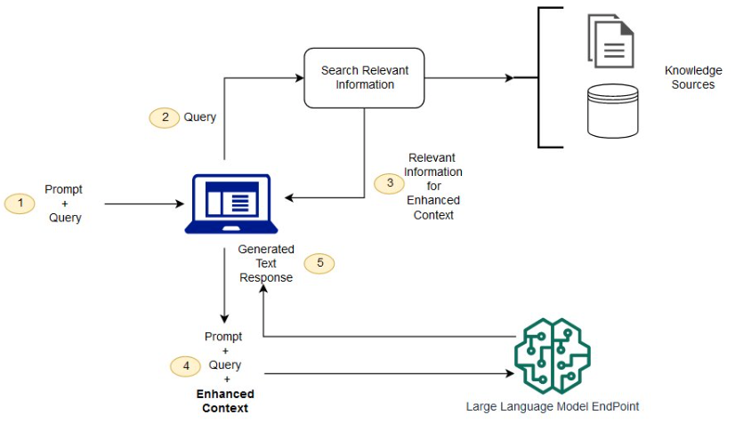

#### [Rethinking the role of demonstrations](https://arxiv.org/abs/2202.12837)

Author: University of Washington & Meta AI  Date: 20 Oct 2022

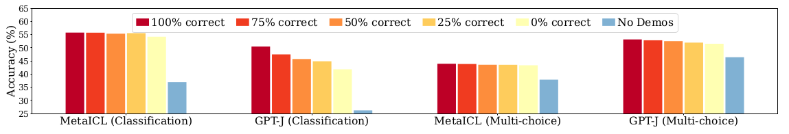

Results with number of correct label in demonstration

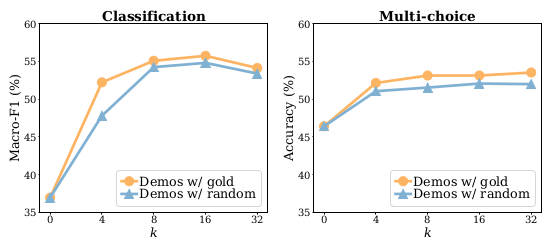

Number of examples in demonstrations

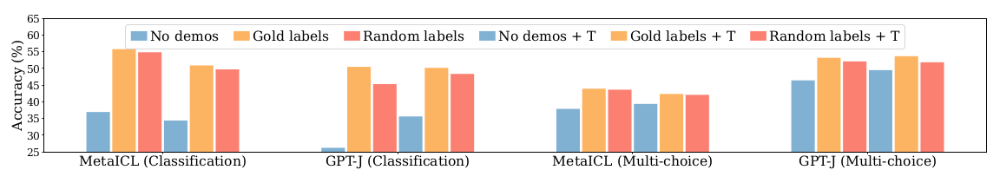

Results with minimal templates and manual templates. ‘+T’ indicates that manual templates are used.

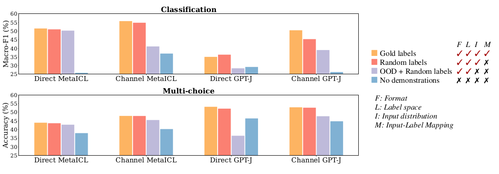

Impact of the distribution of the inputs.

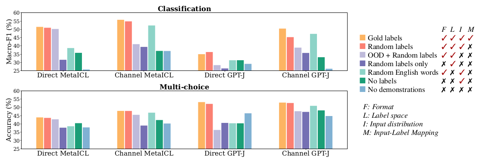

Impact of format.

- Conclusion: 
1. replacing gold label with random label makes the performance drop 0-5%
2. In-context learning finetune 有什么用？ - encourage model to exclusively exploit simpler aspects of the demonstrations and to ignore others.
3. Label doesnt matter, format matters a lot (problem - label correspondence)

### Agent 
#### [HuggingGPT](https://arxiv.org/pdf/2303.17580.pdf)

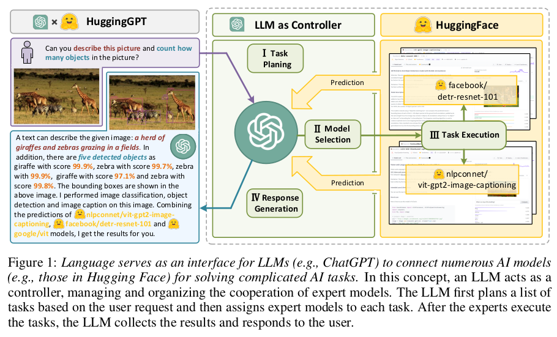

Working flow

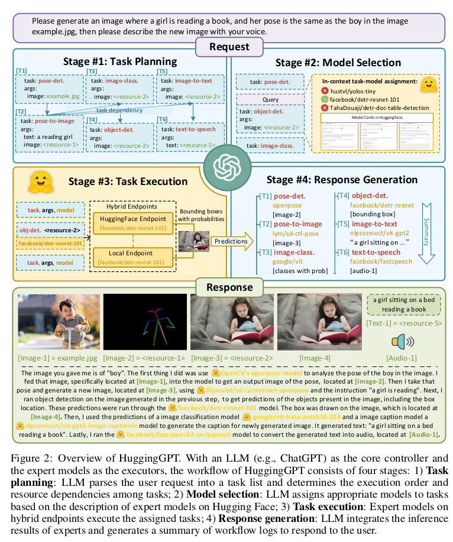

Overview

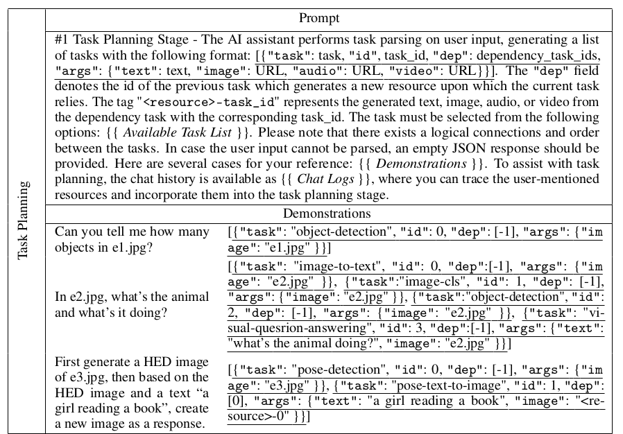
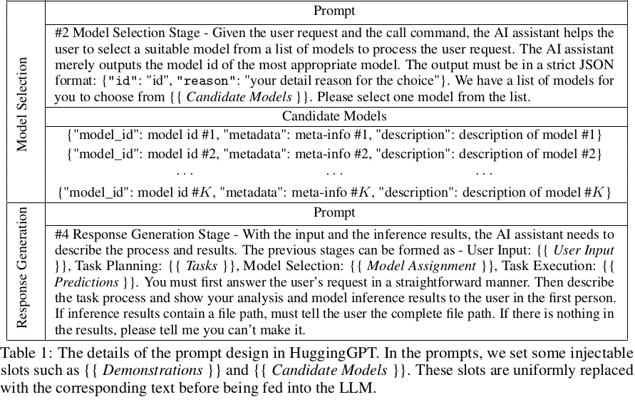

Prompt design

#### [AgentTuning]()

Author: Tsinghua & Zhipu.AI Date: 10.22 2023

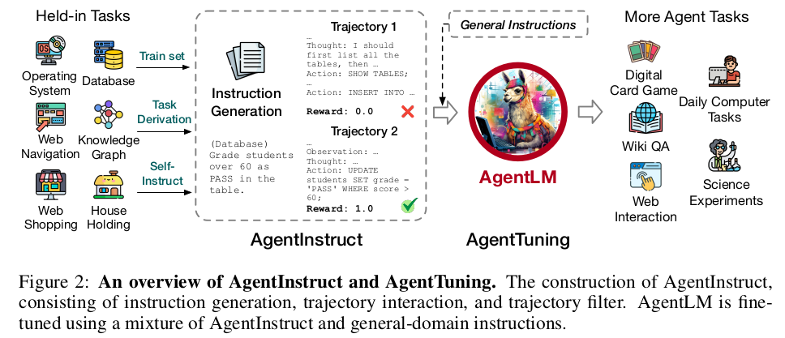

Overview

- Tasks: 
Database task, Operating System task
- Trajectory interactions:
CoT (ReAct)
- Hybrid instruction tuning: 
AgentInstruct Dataset and General Instruct Dataset (Shared_GPT_Vicuna)  
standardize all data into a multi-turn chatbot-style format  

### Action 
#### [Gorilla](https://arxiv.org/pdf/2305.15334.pdf)

Author: UC Berkeley & Microsoft Research  Date: 5.24 2023

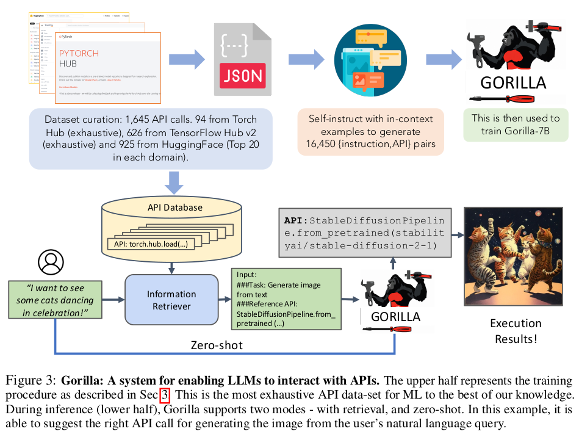

- APIs from Torch Hub, Tensorflow Hub, HF Model Hub.  
- Instruction generated by GPT-4. 
- Call APIs with constraints. e.g. Invoke an image classification model that uses less than 10M
parameters, but maintains an ImageNet accuracy of at least 70%. 
- APIs retriever: add "Use this API documentation for reference: <retrieved_API_doc_JSON>" to prompt, 
    Retriever includes: CLAUDE, GPT-index, BM25; but also support zero-shot   
    Adapt to test time changes  
    Improve performance (not always)   
    Eliminate hallucination
    

#### [BMTools](https://arxiv.org/pdf/2304.08354.pdf)

Author: 清华/人民大学 Date: 1.15 2023

- 工具集（Tool Set）：可供模型使用的各种工具。从交互接口的视角可以分为三类：基于物理交互的工具、基于GUI交互的工具、基于程序交互的工具。
- 控制器（Controller）：通常使用基础模型建模，负责接收用户的指令，并根据这些指令制定可执行的计划并调用工具执行
- 感知器（Perceiver）：负责接收来自环境和用户的反馈信息，并将其汇总给控制器。
- 环境（Environment）：模型所处的场景，包括物理环境和虚拟环境等

#### [ToolBench](https://arxiv.org/pdf/2307.16789.pdf)

Author: 清华/人大/Wechat Date: July 2023

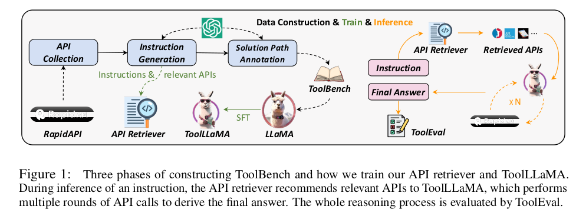

Data collection & train & inference

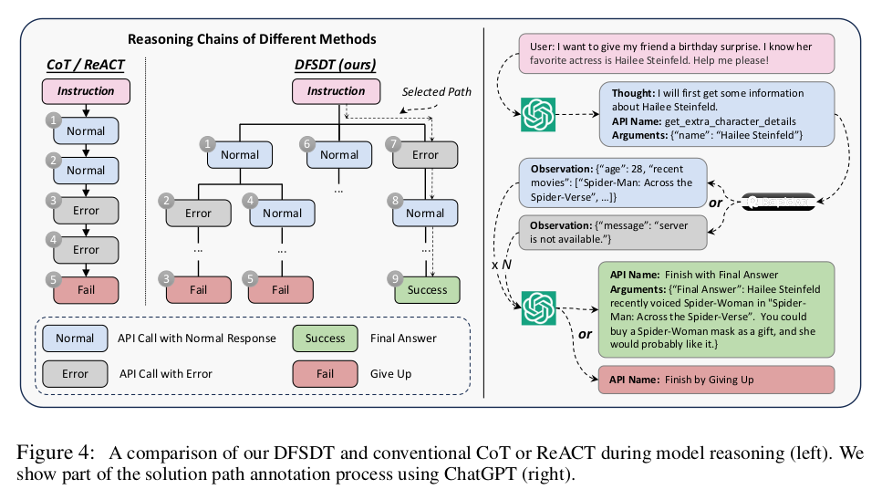

Data Annotation via DFSDT

Contribution
- More real-world APIS  (16,464 APIS), e.g. coupons, game info ...
- Use chatGPT3.5-turbo to generate diverse instructions for APIs (single-tool and multi-tool)
- depth-first search-based decision tree for solution path annotation
- Tooleval Benchmark, evaluate pass rate and win rate. 

先用Retriever筛选相关的API，再用ToolLLaMA进行API的调用并生成最后的结果. Retriever: Bert-uncased    
Planning部分用Depth first searching decision tree (DFSDT) 进行多轮API调用. 

#### [ART](https://arxiv.org/pdf/2303.09014.pdf)

Author: University of Washington & Microsoft 
 

Date:16 Mar 2023

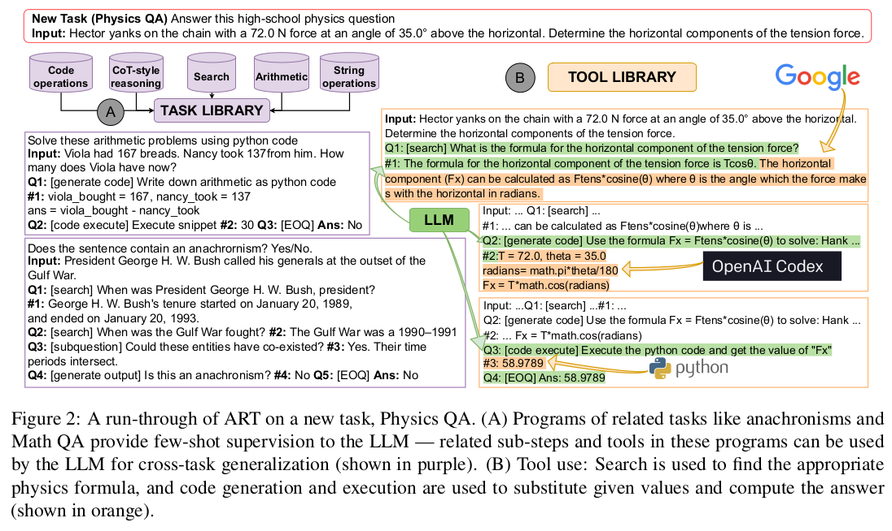

- Method:
1. Task Library: 
including Arithmetic, Code, Search and question decomposition, free-form reasoning, string operations
2. Program Grammar:  
   (Author consider the decomposition of the task, and tool using process is like programs with function callings)  
    Qi: ...  
    #i: ...  
   Stop when tools are used, and at the end, call dummy sub-task "Qi: [EOQ]"  
    Allow human feedback.  
3. Task retrieval:  
For small dataset, iterate all examples and chose the cluster with the highest performance on the held-out set.  
For bigger dataset, compute similarity.   
4. 

### Planning

#### [CoT](https://arxiv.org/pdf/2201.11903.pdf)

Author: Google Research  Date: 10 Jan 2023

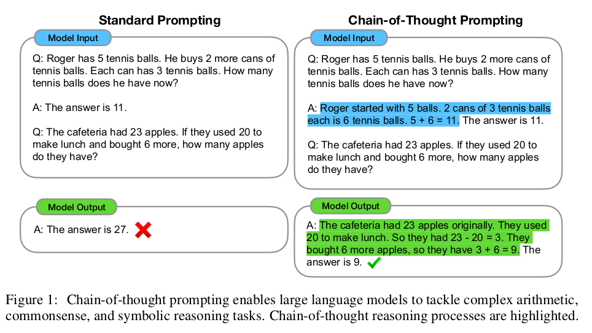

#### [ReAct](https://arxiv.org/pdf/2210.03629.pdf)

Author: Princeton University & Google Research 
 

Date: 5.10 2023

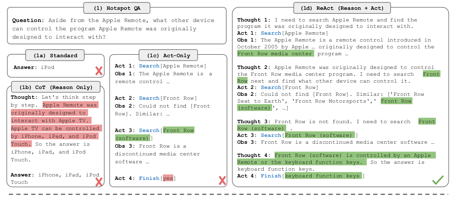

Comparison of ReAct prompts and others.

- Prompting on GPT3 and PALM540b, finetune on PaLM-8/65b
- Dataset: HotpotQA, FEVER
- Action space: Wikipedia api including 'search[entity]', 'lookup[string]', 'finish[answer]'  

#### [Auto-CoT](https://arxiv.org/pdf/2210.03493.pdf)

Author: Shanghaijiaotong & Amazon Mu Li
  

Date: 7 Oct 2022
  

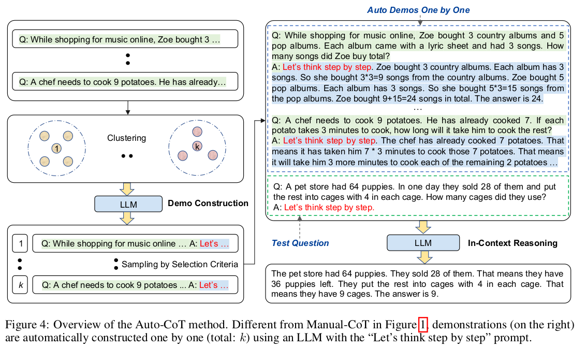

Overview

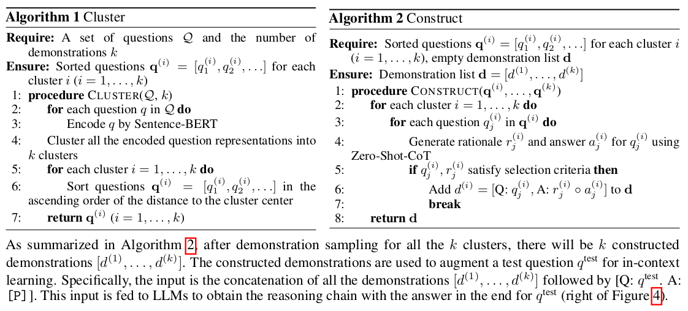

Algorithm

- Contributions: 
1. Sentence-Bert to encode question 
**是不是可以直接用target llm做聚类？ Similarity 是瓶颈吗? 先用LLM作分类，然后再用Bert计算similarity**
2. Compute cosine similarity and retrieve top-k questions.
3. Retrieval-Q-CoT underperforms Random-Q-CoT

**可以通过构建不同demonstration，计算query和demonstration的相似度选择对应的Prompt**

#### [CoT-SC](https://arxiv.org/pdf/2203.11171.pdf)

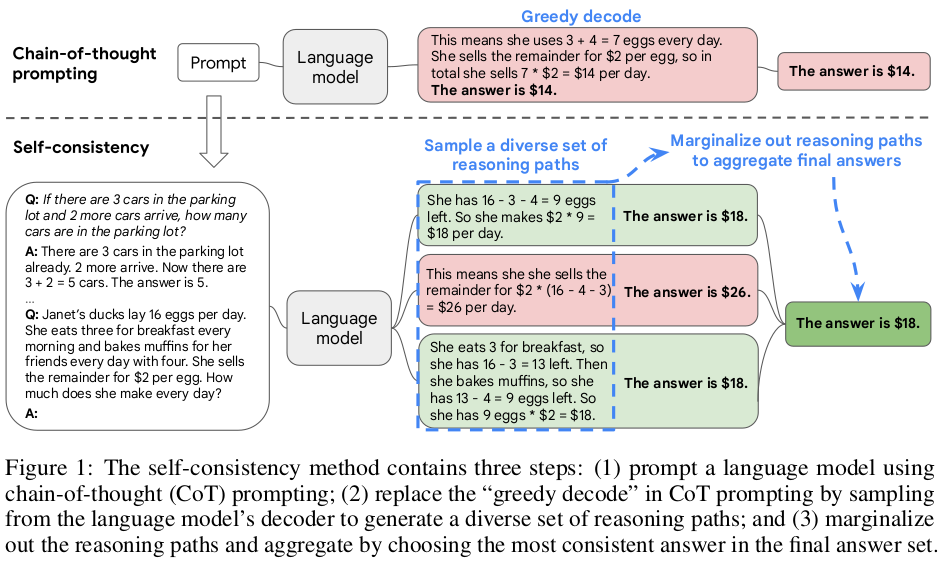

Overview

- Method:   
fixed answer set $a_i \in A$, reasoning path $r_i$ generated from the i-th output, self-consistency applies a 
marginalization over $r_i$ by taking a majority vote over $a_i$, i.e. 
$$
argmax_a \Sigma_{i=1}^m (a_i = a)
$$

Or can be normalized:   
$$
P(r_i, a_i | prompt, question) = exp^{\frac{1}{k} \Sigma_{k=1}^K logP(t_k|prompt, question, t_1, ..., t_{k-1})}
$$

One should note that self-consistency can be applied only to problems where the final answer is from a fixed answer set, but in principle this approach can be extended to open-text generation problems if a good metric of consistency can be defined between multiple generations, e.g., whether two answers agree or contradict each other.

#### [Multimodal-CoT](https://arxiv.org/pdf/2302.00923.pdf)

Author: ShangHai jiaotong & Amazon

Date: 17 Feb 2023

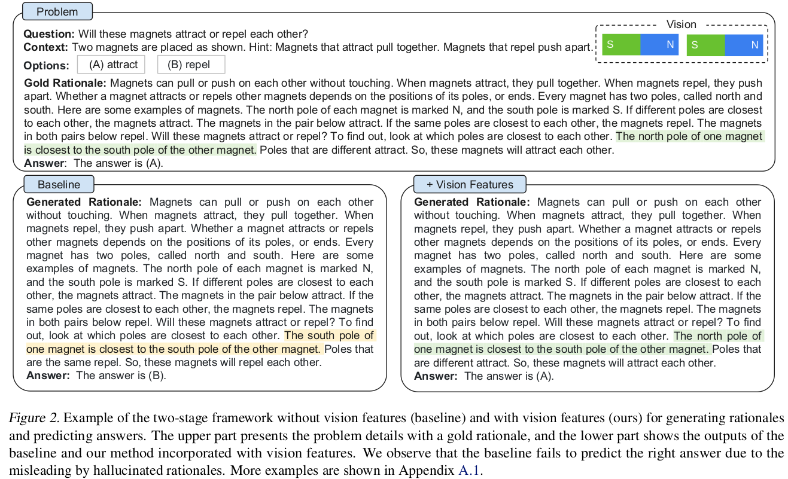
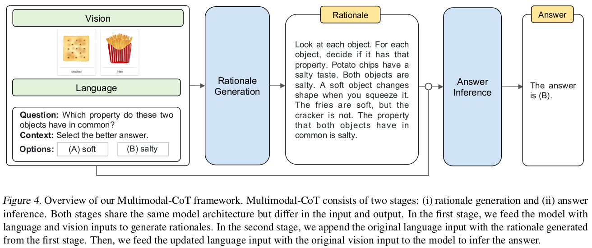
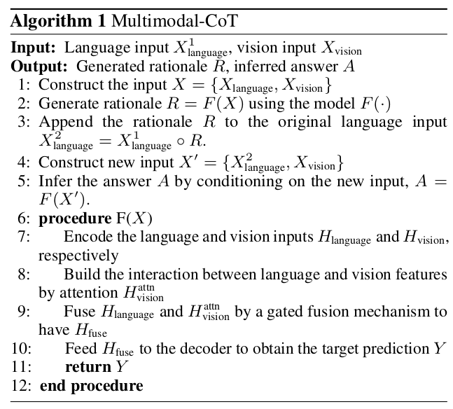

- Method:
1. Stage 1: Rationale generation   
Vision encoder: DETR  
Language encoder: UnifiedQA weight to initiate T5  
2. Stage 2: Answer inference  
   (two-stage的训练推理，和直接把正确的rationale丢进去训练有什么区别？？)

#### [Finetune CoT](https://arxiv.org/pdf/2212.10071.pdf)

Author: KAIST

Date: 13 Jun 2023

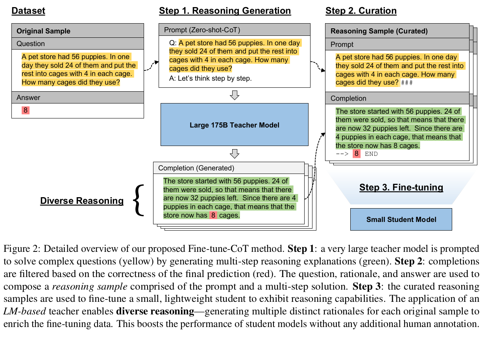

- Method: 
1. Prompt template: Specifically, pi and ci each take the form of “<qi> ###” and “<r̂i>--> <ai> END”.  
2. Annotated multiple reasoning paths
- Models: 
Teacher:  InstructGPT - davinci-002 175B  
Student:  GPT2, T5

#### [ToT](https://arxiv.org/pdf/2305.10601.pdf)

Author: Shunyu Yao Princeton University & Google DeepMind
 

Date: 3 Dec 2023

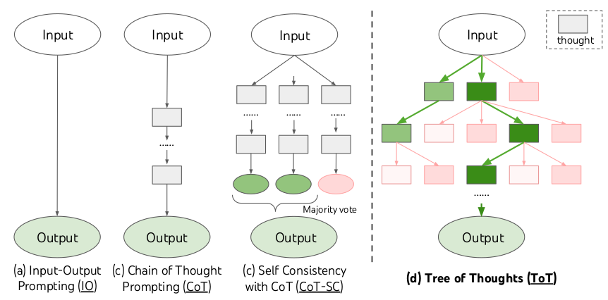

- Method: 
1. Task decomposition
2. Generate potential thoughts: Sample & propose
3. evaluation metrics: Value & Vote
4. Searching method: BFS & DFS

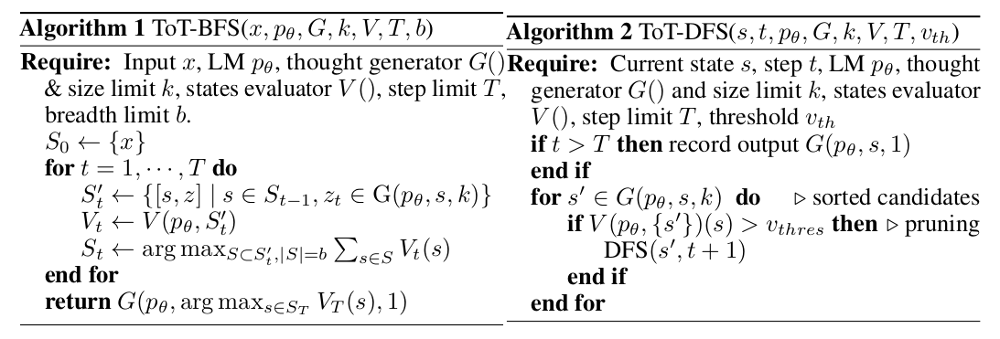

#### [RAP](https://arxiv.org/pdf/2305.14992.pdf)

Author: UCSD & University of Florida

Date: 23 Oct 2023

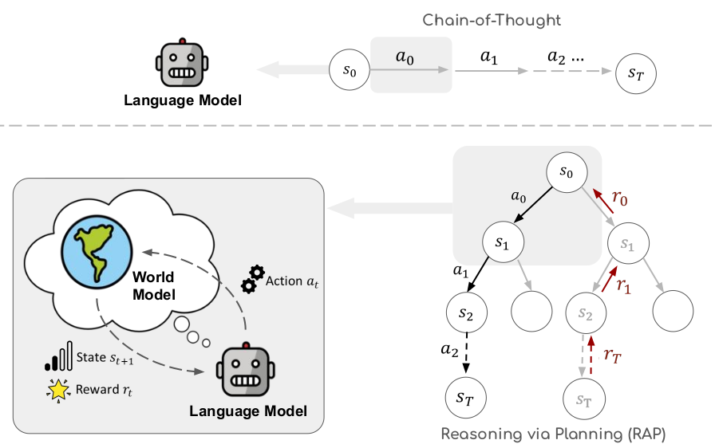

Overview

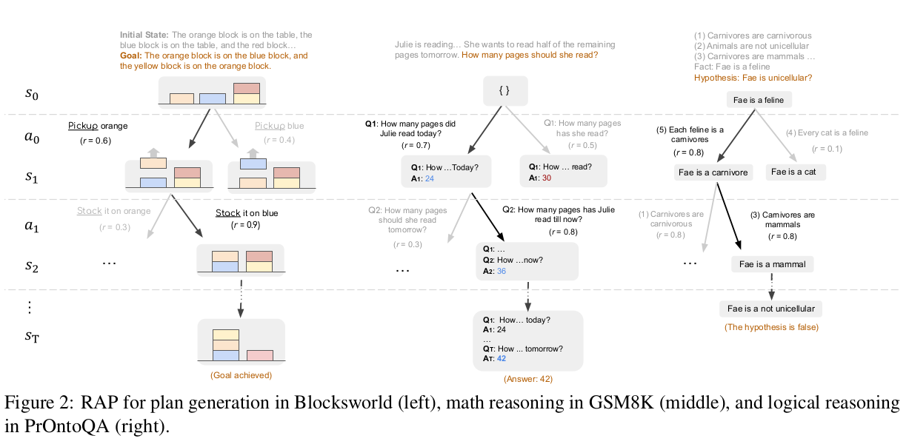

- Method:
1. Define State and Action:   
e.g. in math reasoning, State is the values of intermediate variables, Action is the subquestions.
2. Reward Design:  
Likelihood of the action.  
Confidence of the state.  
Self-evaluation by the LLM  
Task-specific heuristics.  
3. Monte Carlo Tree Search:  

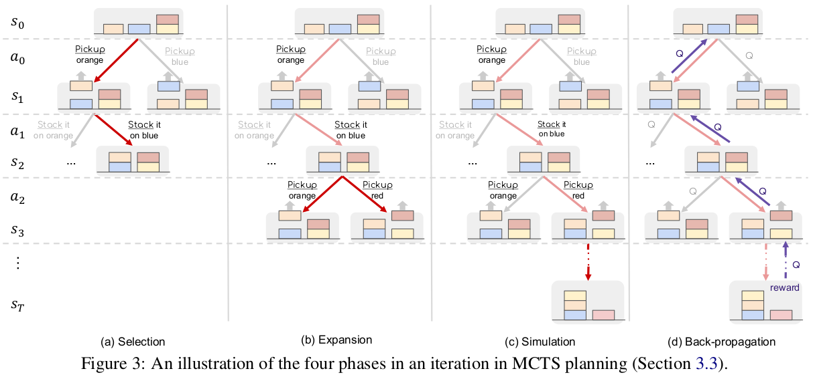

#### [RLP](https://arxiv.org/pdf/2305.12647.pdf)

Author: SocialAGI  Date: 22 May 2023    

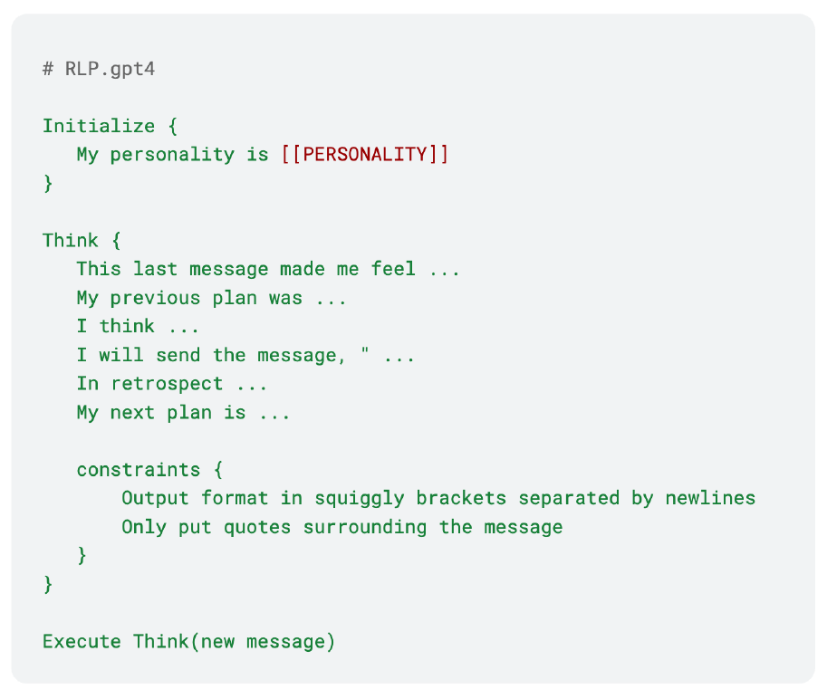

Modeling human social cognition, parameterized by PERSONALITY.

- Method: 
1. Initialization: 给模型设定初始状态$S(t)$,  
2. Introspection: 
3. Recall 
4. Message formation 
5. Retrospection 
6. Planning  

#### [ReWOO](https://arxiv.org/pdf/2305.18323.pdf)

Author: Binfeng Xu  Date: 23 May 2023

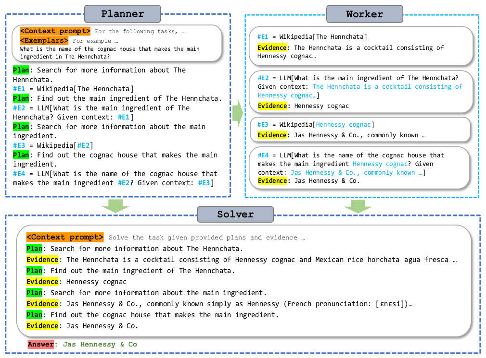

- Method
1. Planner:  
Planner generate consecutive tuples (P lan, #E) where P lan represents a descriptive message of the
current step, and #Es, subscripted by step number s, is a special token to store presumably correct
evidence from corresponding designated Worker『Instruction』.
2. Worker:  
Worker interact with the environment through tool-calls. Once Planner provides
a blueprint, designated Workers are invoked with instruction input, and populate #E s with real
evidence or observations.
3. Solver:   
Solver processes all plans and evidence to formulate a solution to the original task or problem

#### [Reflexion](https://arxiv.org/pdf/2303.11366.pdf)

Author: Northeastern University  Date: 10 Oct 2023 

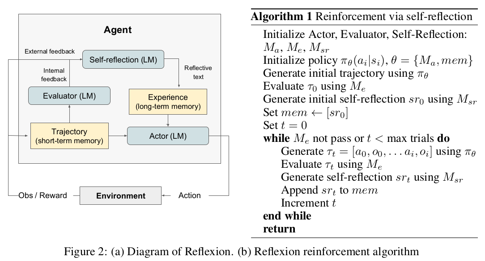

- Method: 
1. Actor: LLM + CoT / ReAct/ ...
2. Evaluator: reasoning task - exact match grading; decision making - heuristic function;  
3. Self-reflection model: provide verbally feedback to the trajectory, and then stored into long-term memory.
4. Memory: 
   short-term memory (trajectory) & long-term memory (store reflexion), and then forward to Actor to generate new traj
5. The reflexion process: 

**Get Reward score**

#### [Retroformer](https://arxiv.org/pdf/2308.02151.pdf)

Author: Salesforce  Date: 4 Aug 2023

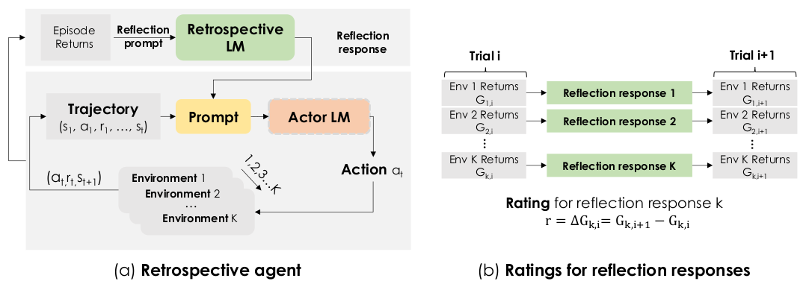

Framework

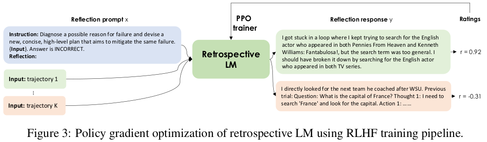

Mr training pipeline

- Challenges for LLM-based agent:
1. Spurious action
2. Limited prompt length
3. Heuristic prompt engineering
4. Prohibitive training 

- Method: 
1. Actor model: LLM with ReAct
2. Retrospective model: 
3. Memory: long-term memory & short-term memory
4.  

#### [Active Prompt](https://arxiv.org/pdf/2302.12246.pdf)

#### [Lost in Middle](https://arxiv.org/pdf/2307.03172)

Author: Stanford  Date: 20 Nov 2023

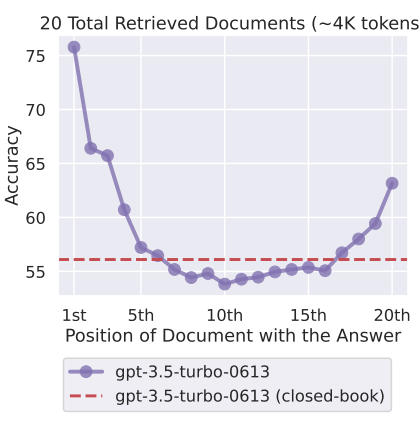

Framework

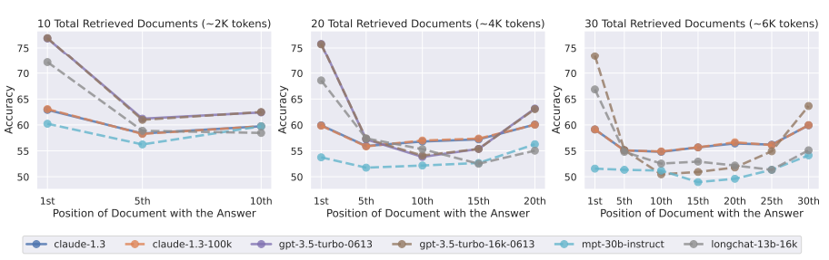

Performance

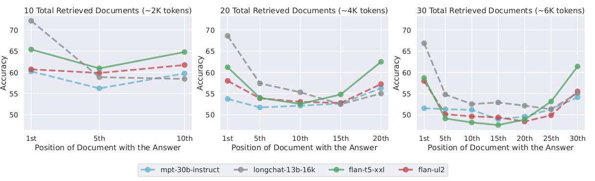

Experiment result of Encoder-decoder model

#### [Principle Instruction](https://arxiv.org/pdf/2312.16171)

- Method: 
1. Prompt Structure and Clarity
2. Specificity and Information
3. User Interaction and Engagement
4. Content and Language Style
5. Complex Tasks and Coding Prompts
6. 

#### [Buffer CoT](https://arxiv.org/pdf/2406.04271v1)

Author: Peking Uni & UC Berkeley Date: 6 Jun 2024

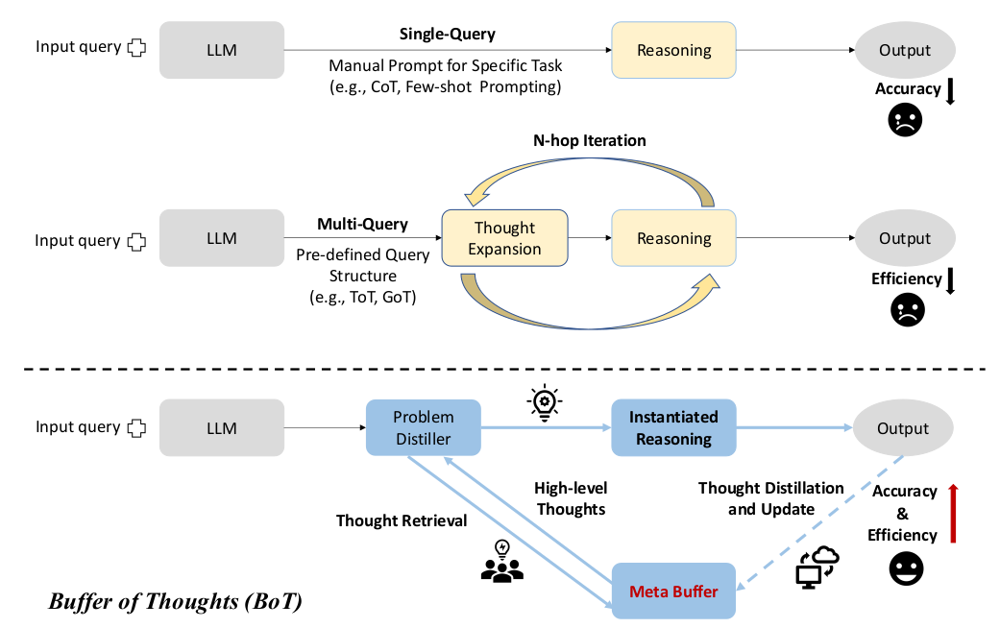

- Method:

#### [KAFT](https://arxiv.org/pdf/2211.05110)

Author: Google Research & DeepMind  Date: 9 Nov 2022

- Method: 
1. Knowledge-Augmented Finetuning for Large Language Models: KAFT
2. Construct relevant context and counterfactual context 
- relevant context   
- model’s pretrained world knowledge (1)  
- irrelevant context, (2)

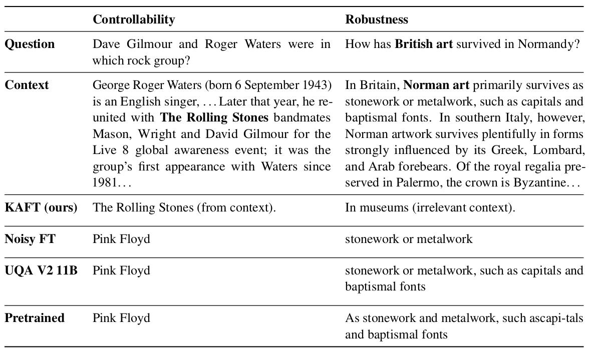

KAFT problem

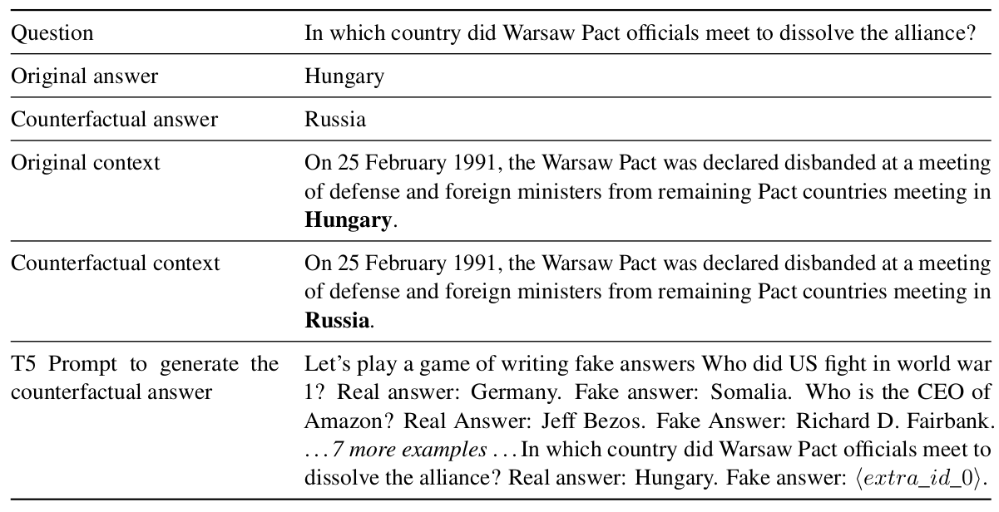

Counterfactual context example

#### [GPO]()

author: Gaoling & Remin University  Date: 17 Apr 2024

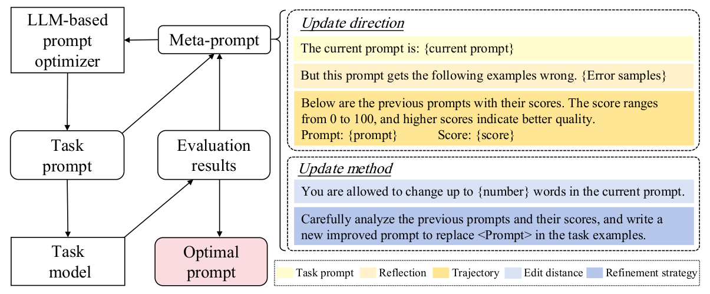

- Method:
1. Consider prompt optimization like gradient descent. 

#### [DSpy](https://arxiv.org/abs/2310.03714)

Author: Standford & UC Berkeley Date: 5 Oct 2023

#### [MIPRO](https://arxiv.org/pdf/2406.11695)

- Method: 
1. LLM Program Optimizer: 
- Bootstrapping Demonstrations: sample input/output trace, if $\miu(\Phi(x), x_{}) \eqlargeto \theta$ ,this all value in trace 
as a potential labeled demonstration for the respective module in \Phi,. Then find the effective combination of the demonstrations.

#### [in-context learning survey]()

#### [Demonstration-Predict-Optimize]

#### [Fantastically ordered prompt](https://arxiv.org/pdf/2104.08786)

Author: University of London  Date: 3 Mar 2022

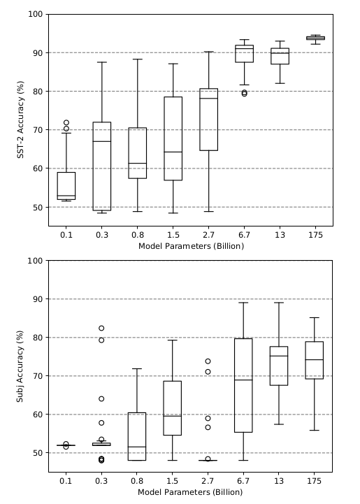

Four-shot performance for 24 different sample orders across different sizes of GPT-family models

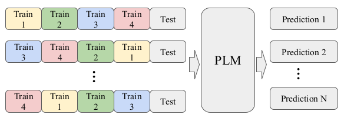

Training sample permutations for the In-context Learning setting.

- Conclusion:
1. Adding training samples does not significantly reduce variance
2. Performant prompts are not transferable across models
3. Degenerate behaviour of bad prompts (unbalanced predicted label distribution)

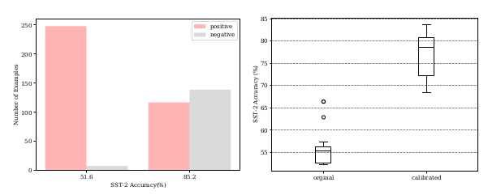

- Methodology
1. 基于假设：大多数使模型实效的prompt的顺序，会让模型预测的标签分布与真实分布有较大偏差
2. 用不同permutation的prompt顺序，输入到模型中，让模型生成一系列同分布的任务
3. 在计算Global Entropy & Local Entropy，计算生成标签的分布，让模型实效的prompt顺序，会让标签更加unbalanced，entropy较低。

#### [Self-instruct with self-generated instructions](https://arxiv.org/pdf/2212.10560)

#### [Prompt survey](https://arxiv.org/pdf/2107.13586)

