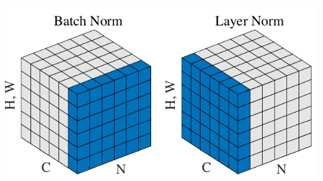
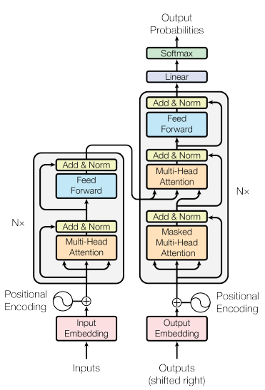
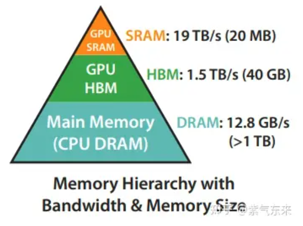
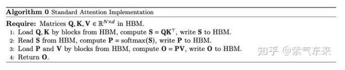
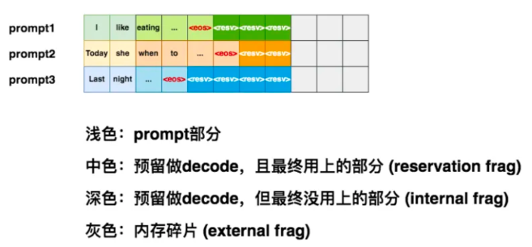
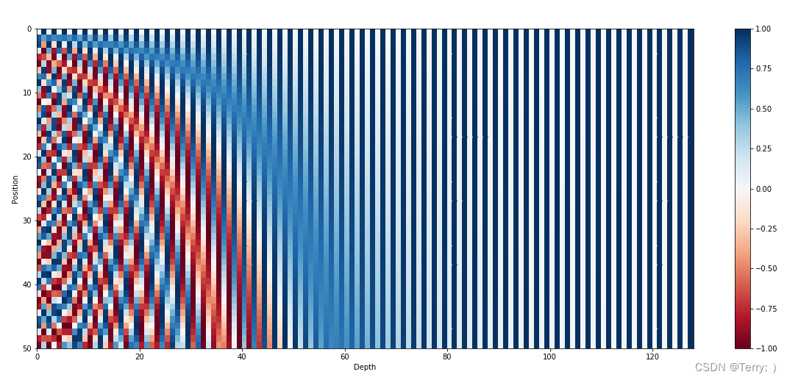
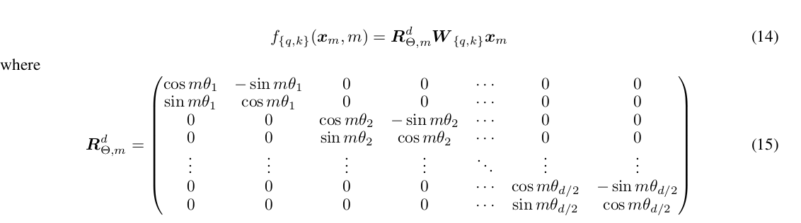

## 1. Normalization
ref sources: 
(https://snailcoder.github.io/2024/05/01/batchnorm-and-layernorm.html)
1. Why normalization: 
为了缓解梯度消失和梯度爆炸，把feature归一化到0-1，让模型比较好训.
2. Formula
$$
y = \frac{x - \mathbf{E}[x]}{\sqrt{\mathbf{Var}[x]}} * \gamma + \beta 
$$
其中 $\gamma$ 和 $\beta$ 为可学习参数，初始值为0和1，
3. 训练时使用移动均值和方差，evaluation时使用训练集的均值和方差。因为可以理解训练集较大，更加接近样本的真实分布。
moving_mean = momentum * moving_mean + (1 - momentum) * var
moving_var = momentum * moving_var + (1 - momentum) * var
momentum = 0.99

- BatchNorm:
<div align="center">

</div>
不同batch 的样本，对channel做normalization

- LayerNorm:
同一个batch的样本，对l和d做normalization
为什么不用batchnorm？1. 首先肯定因为l长度不一样。 2. 对batch size不敏感。3. 自然语言每个样本中token和前后token的相关性比较高，
对不同batch做归一化没意义。

- GroupNorm:
何凯明提出的，一般用在cv里，替代BN. Divided channel into nm_groups, 
```python
import torch

x = torch.normal(0, 1, (n, d, h, w))
x = x.reshape(n, -1, d // num_groups, h, w)
group_normed = (x - x.mean(-3, -2, -1)) / x.var(-3, -2, -1)
```
可以避免batch size 的影响

- RMSNorm: (Root Mean Square Norm)
normalization分为 shift和rescale，作者认为有用的部分是rescale的部分（即处以ariance），而不是shift
所以提出RMS Norm，计算比LN更便宜而且更快。
$$
\bar{a}_i = \frac{a_i}{\mathbf{RMS}(a)} g_i \\
where ~ \mathbf{RMS}(a) =\sqrt{\frac{1}{n}\sum_{i=1}^{n} a_i^2}
$$

## 2. Attention:
<div align="center">

</div>

1. Attention 为什么处以 $\sqrt{d_k}$?  
因为d越大，QK点乘的值越大，过softmax的时候更容易落入softmax的饱和区，会梯度消失。
2. Flash Attention (https://zhuanlan.zhihu.com/p/638468472):

<div align="center">

<div> attention计算时的瓶颈在HBM的读写 </div>

</div>

Flash attention 的优化：
- **Tiling**:
将输入分割成块，放到SRAM上算
- **Recomputing**：
只存储softmax的归一化因子，重新计算attention

3. Page Attention (https://aijishu.com/a/1060000000458185):  
Prefill 阶段：把整段prompt喂给模型的forward计算
Decode 阶段：模型一个token一个token生成的阶段

目前KV Cache推理时遇到的问题：

<div align="center">

</div>

vLLM的优化： 
- 将整段的KVCache按照token划分为不同块，如16个token。
- 可以将块视为页面，将 token 视为字节，将序列视为进程。
- 维护Block Table，序列的连续逻辑块通过块表映射到非连续物理块中。
- 物理块在生成新 token 时按需分配。

## 3. Positional Encoding
1. 为什么需要positional encoding？
因为RNN的时候，输入到模型里的sentence是有顺序的，但是transformer使用attention结构，对每个sequence是并行计算的，所以需要加入位置编码。
2. Positional Encoding 需要满足的条件：
- Unique encoding for each position
- Consistent Distance between any two positions (across sentences with different lengths).
- Bounded values (Model can generalize to longer sentences without any efforts.)
- Deterministic values.
3. 不同PE算法：
- 最简单的绝对位置编码，不具有外推性
- [0, 1] 位置编码，离散的不连续，不同词出现在不同位置的时候距离不一样
- [0, 1] 插值，不满足第二条。
- Sinusoidal Positional Embedding: 有界的，连续的，但是只考虑相对位置信息，不易内推 
$$
M PE(pos) = PE(pos + k)
$$

随着相对距离越远，编码的值在递减。
<div align="center">

</div>
比较贵，而且只考虑相对位置信息，不一定都meaningful，比如句号在句尾？  

- T5：  
比较贵，而且工程实现很麻烦。 
- Rope：一种绝对位置编码方式实现的相对位置编码。(https://zhuanlan.zhihu.com/p/638468472)
内推性和外推性都不错。
目标： find a function PE(x, l), 只与x和它的位置l有关
对于两个item q，k 在sequence上的位置是m，n，他们的距离只与(m-n)有关
即：

$$
<f_q(q_m, m), f_k(k_n, n)> = g(q_m, k_n, m-n)
$$

作者利用欧拉公式，给出一个形式：
$$
f_q(q_m, m) = q_me^{im\theta} = (W_qx_m)e^{im\theta}
$$

对于高维的结果：

<div align="center">

</div>


## LSH & MinHash
1. Shingling: 将文本转换为集合表示
2. Min-Hashing: 将高纬度的向量转换为低维的哈希值，再计算哈希值的Jaccard相似性
3. Locality-sensitive Hashing: 比较相似性比较高的文档

Jaccard Distance:
$$
Jaccard(C_i, C_j)  = \frac{|C_i \cap C_j|}{|C_i\cup C_j|}
$$

Min-Hashing:
$$
minhash(C_i, C_j) = Jaccard(sig(C_i), sig(C_j))
$$


## Optimizer (https://blog.csdn.net/lgzlgz3102/articel/details/119769839)
GD: $\theta_{t+1} = \theta_t - lr * \delta L(\theta)$
1. SGDM: 加入momentum
$$
g_t = \partial L(\theta) \\
m_t = \beta m_{t-1} + (1 - \beta) g_{t} \\
\theta_{t+1} = \theta_t - lr\cdot m_t \\
$$
2. Adagrad: 加入二阶梯度
$$
V_t = \sum_{\tau = 1}^t g_{\tau} ^2 \\
\theta_{t+1} = \theta_{t} - lr/ \sqrt{V_t} \cdot g_t
$$
3. Adam: momentum + 二阶梯度
$$
m_t = \beta_1 \cdot m_{t-1} + (1-\beta_1) \cdot g_t \\
V_t = \beta_2 \cdot V_{t-1} + (1-\beta_2) g_t^2 \\
\theta_{t+1} = \theta_t - lr/V_t \cdot m_t
$$
4. AdamW： momentum + 二阶梯度 + L2正则
把正则项直接加在参数更新的地方，而不是gradient里，即不参与$V_t$二阶梯度 和 $m_t$动量 的计算。  
为什么： Bert 里做实验了，发现本来加到里面计算会有很奇怪的现象？？


