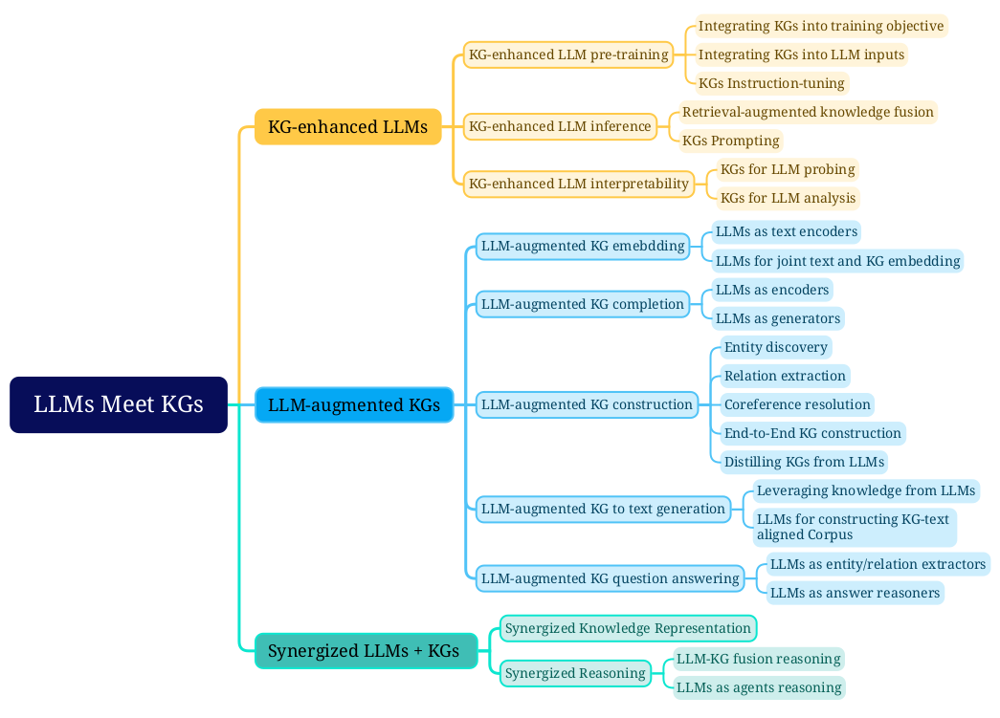

## RAG

The general framework of the synergized LLMs + KGs

Fine-grained categorization of LLMs and KGs.

## 关于为什么要使用RAG
为什么要使用RAG而不把知识训到模型里：
1. 训练成本： finetune模型的成本比较高，domain-specific的knowledge更新很快，很难做到一直训练。
2. 可控性/可解释性：  
因为检索的过程可解释，也更好评估，可以finetune模型使用知识的能力，使模型生成的内容更加可控。
直接把知识训到模型里，更加节省空间和时间成本，但是不可控，而且比较难以评估模型是否真的学到了对应的知识。
这两个肯定是都需要的，未来的形态可能是多个模型，会有RAG + online的Lora模型更新，即外部知识和模型内部知识都会持续更新。

### Papers

#### [MemoRag](https://github.com/qhjqhj00/MemoRAG)

Author: Gaoling Date: 10 Sep 2024

