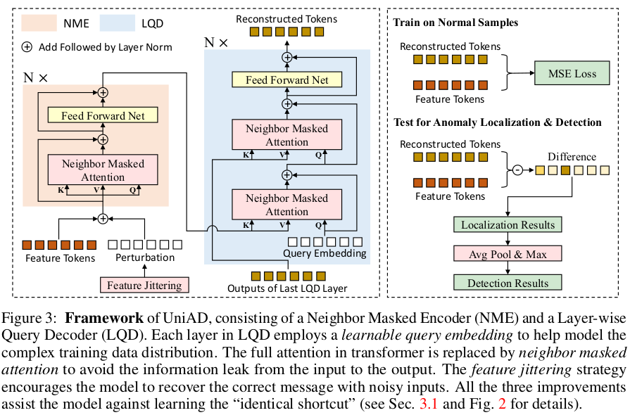

## 2023.02.10 Weekly Report

Xiaoxuan Tang  Fri 2023.02.10

### Lizard api support: 

- loading / saving model and encrypt
- Inference method
- bugs fix

### Some experiments:
- Use ConvNeXt as backbone:

- Suzhou Fabric (AABB):

  Training:  
  original image: shape=(8000, 6800, 3), num=445  
  split image: shape=(2000, 1700, 3), num=3466
  
  Testing:
  image_size: 1024*1024  
  test good: 总30张正常，1过杀  
  test abnormal: 总24张异常，0漏检   
  test result:  
  
  过杀结果  
   
  
  可以看出应该是由于我标的标签噪声问题  

  异常检出结果  
  

### Others:
- 未来中心调bug
- lizard调bug

### Literature Review:

To find more detail:  <https://gitlab.edgeai.org:8888/tangxx11/karazhan.git>

- [ConvNext](https://arxiv.org/abs/2201.03545)

  SOTA on ImageNet1k, modified resnet-based model into Swin Transformer architecture.

- [UniAD](https://arxiv.org/pdf/2206.03687v3.pdf) 

  Working on "short-cut" problem in reconstruction-based method, proposed a new method uses transformer-based attention as decoder. 

  
  

- [EdgeRec](https://arxiv.org/pdf/2210.14485v1.pdf) 

  Input grayscale, noisy edge image as input to reconstruct RGB image 

  

- [FAPM](https://arxiv.org/pdf/2211.07381v1.pdf)

