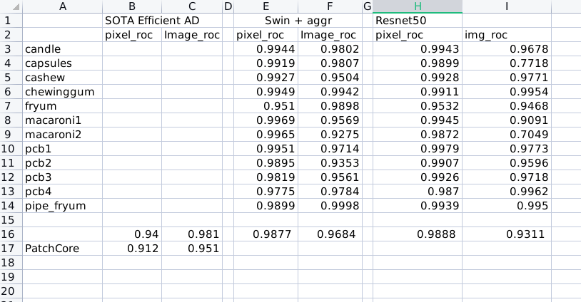
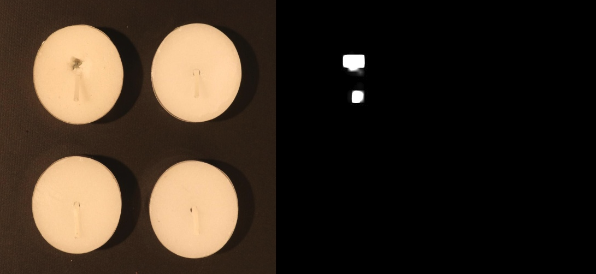
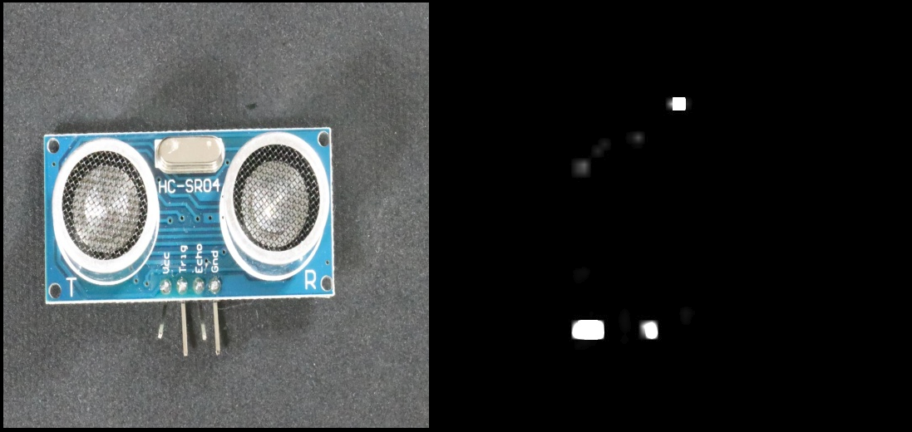
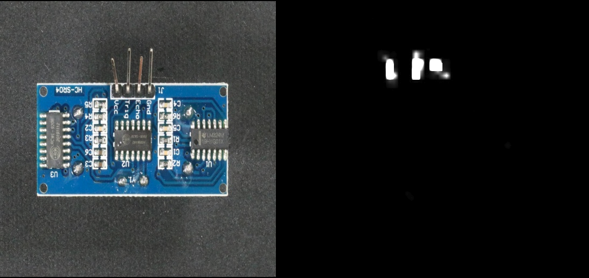

## 2023.0721 Weekly Report

Xiaoxuan Tang  Fri 2023.07.21

### Lizard API support: 

- [x] Update version 1.1, version info: add GroundingDINO backbone
- [x] Release to nexus repositories 
- [x] bugs fix

### CATL support
- [x] 梳理一体机成像,PSA 检测项
- [ ] 如何建模的详细的文档

### Algorithm
- [ ] Industrial dataset collection (undergoing)

- [x] Use Grounding DINO as backbone 由于需要构建20个模型，跑了一下VisA做实验，结果:

Sample Results:

- [x] Refine segmentation heatmap, (try raw heatmap as prompt)： 

  Mask prompt 效果不好, 模型输出结果倾向分割前景背景，而不是缺陷区域。检查是否mask prompt输入有问题

  bbox ground truth 生成了多个框，肉眼看结果还可以，但是IOU提升不明显 (Headtail raw heatmap: IOU = 0.489, SAM mask: IOU=0.490 )，怀疑算错了，没在找原因。

- [ ] 模型Finetune，计划用VisA（每个测试集200张图，正常样本上1千张）数据集finetune，刚写完model.py

- [ ] Xmem

- [ ] Add GD to headtail memory optimization (写了一半)

### Others

- [x] Intern interview (Wed, 2 pm)

